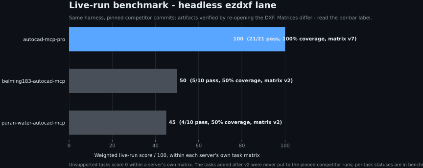
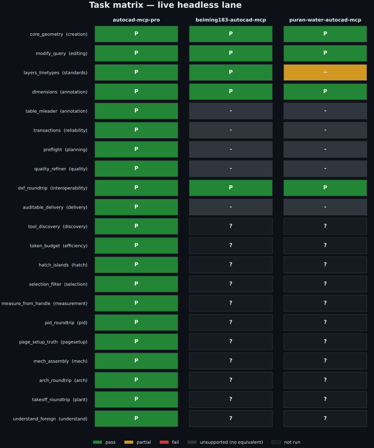
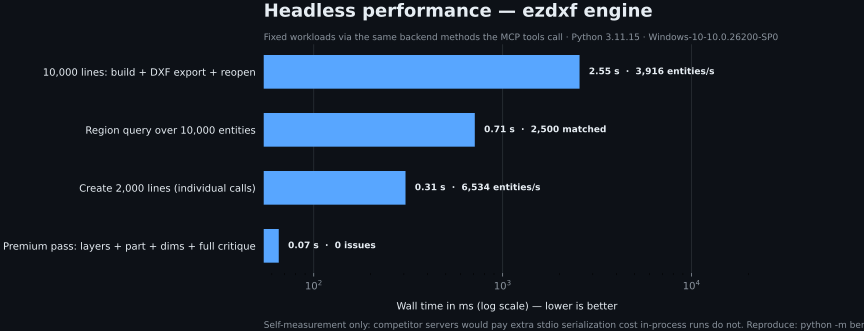
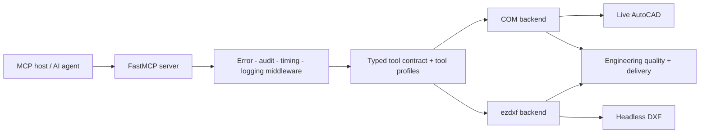

# AutoCAD MCP Pro

Production-grade AutoCAD automation for AI agents — live through COM on
Windows, or headless through ezdxf on any platform.

[](https://github.com/U-C4N/Autocad-MCP/actions/workflows/ci.yml)
[](https://pypi.org/project/autocad-mcp-pro/)
[](LICENSE)
[](pyproject.toml)
[](https://github.com/jlowin/fastmcp)
[](https://github.com/U-C4N/Autocad-MCP/stargazers)

One typed MCP contract controls two execution engines. Build and edit drawings,
query exact geometry, apply engineering standards (ISO 128/129/286/1101),
refine quality issues inside transactions, and deliver hashed artifacts with
validation evidence.

> **v1.5 release snapshot:** 154 tools · 6 resources · 5 prompt templates ·
> 1245 collected tests. Runtime discovery through `system_about` is authoritative.

## Install in 10 seconds

```bash
pip install autocad-mcp-pro     # or: uvx autocad-mcp-pro
autocad-mcp                     # stdio MCP server, backend auto-selected
```

Headless (no AutoCAD required, any OS) or live AutoCAD on Windows:

```bash
AUTOCAD_MCP_BACKEND=ezdxf autocad-mcp    # portable DXF engine
AUTOCAD_MCP_BACKEND=com   autocad-mcp    # live AutoCAD (pip install "autocad-mcp-pro[com]")
```

Extras: `[com]` live AutoCAD (pywin32 + Pillow), `[pdf]` PDF/screenshot
rendering (matplotlib), `[full]` everything. Working from a checkout is the
same commands with `pip install -e ".[full]"` and `python server.py`.

## Benchmarks

Every number below is generated by a script in [`benchmarks/`](benchmarks/)
and rendered to SVG with Python (matplotlib). No hand-edited charts, no
adjectives.

### The leaderboard — nine public AutoCAD MCP servers, one rubric


| # | Project | Score | Evidence |
|--:|---|---:|:---:|
| 1 | **[U-C4N/Autocad-MCP](https://github.com/U-C4N/Autocad-MCP)** (this repo, v1.4.0) | **95** | A |
| 2 | [varavista/autocad-mcp](https://github.com/varavista/autocad-mcp) | 84 | A |
| 3 | [beiming183-cloud/AutoCAD-MCP](https://github.com/beiming183-cloud/AutoCAD-MCP) | 83 | A |
| 4 | [LokmenoWer/best-cad-mcp](https://github.com/LokmenoWer/best-cad-mcp) | 74 | B |
| 5 | [AnCode666/multiCAD-mcp](https://github.com/AnCode666/multiCAD-mcp) | 73 | A |
| 6 | [puran-water/autocad-mcp](https://github.com/puran-water/autocad-mcp) | 70 | A |
| 7 | [NCO-1986/AutoCAD_mcp](https://github.com/NCO-1986/AutoCAD_mcp) | 68 | B |
| 8 | [daobataotie/CAD-MCP](https://github.com/daobataotie/CAD-MCP) | 35 | B |
| 9 | [zh19980811/Easy-MCP-AutoCad](https://github.com/zh19980811/Easy-MCP-AutoCad) | 30 | C |

Fixed public 100-point rubric — CAD breadth (25), correctness and delivery
(20), backends/platforms (15), engineering production (15), tests and
maintenance (15), security and operations (10) — applied to the public source
and documentation of each project
([`benchmarks/source_review.json`](benchmarks/source_review.json), dated).
Stars and raw tool counts score nothing. Evidence grade **A** = source plus
locally executed evidence, **B** = deep source review without a full live run,
**C** = documented tool surface only. This is a source review, not a shared
live run — the lanes below are the runtime evidence.

**The table above is not re-scored per release.** It reads the dated review,
and this repository's row is still the one written against v1.4.0. Raising our
own number for v1.5.0 would mean re-reviewing eight other projects on the same
day to keep the comparison fair, and that has not been done — so the score
stays where the evidence is.

```bash
python -m benchmarks.render_chart
```

### 1 · Live-run scores — same harness, pinned competitors



| Server | Matrix | Pinned commit | Score | Pass | Coverage |
|---|---|---|---:|---:|---:|
| **autocad-mcp-pro** (this repo) | v3 (15 tasks) | working tree | **100.0** | 15/15 | 100% |
| [beiming183-cloud/AutoCAD-MCP](https://github.com/beiming183-cloud/AutoCAD-MCP) | v2 (10 tasks) | `11f7c47` | 50.0 | 5/10 | 50% |
| [puran-water/autocad-mcp](https://github.com/puran-water/autocad-mcp) | v2 (10 tasks) | `95476a3` | 45.0 | 4/10 | 50% |

**Read the matrix column before the score column.** The five v3 tasks are new
in v1.5.0; the competitor runs are pinned at v1.4 and were never put to them.
Their scores are over the ten tasks they actually ran, and the five new rows
are left blank in the chart rather than scored zero — an invented zero is
indistinguishable from a measured one.

One runner, headless ezdxf lane. Competitors are driven **black-box over MCP
stdio** using their own documented tool contracts at the pinned commit, and
every geometry claim is verified by re-opening the exported DXF with ezdxf
inside the harness — no self-reporting. `unsupported` scores zero within a
server's own matrix; a capability refusal is recorded as `unsupported` rather
than `fail`, because "cannot reach this" and "got this wrong" are different
findings. Per-task reasons are committed under
[`benchmarks/results/published/`](benchmarks/results/published/). File-IPC
(live AutoCAD) lanes run locally, not in CI.

```bash
python -m benchmarks.run_competitors --list --matrix v3
python -m benchmarks.run_competitors --server autocad-mcp-pro --matrix v3 \
    --publish benchmarks/results/published/autocad-mcp-pro.json
python -m benchmarks.render_live_chart
```

### 2 · Task matrix — where the score comes from



The single score hides *which* capabilities exist, so the matrix shows every
task against every server: green = verified pass, amber = partial, gray = the
server documents no equivalent (planning, refinement, TABLE/MLEADER, hashed
delivery), red = attempted but failed verification, blank = never run against
that server.

The v2 matrix scored this repository 10/10, and that was not a good sign —
every task in it exercised something the server was built around, so full
marks were the only possible outcome. **v3 adds five tasks chosen because they
can fail**, and three of them did fail while being written: a hatch could not
be measured at all, the boundary tools disagreed with the measurement tool
about the same shape, and a circle stored as two bulged vertices measured zero.

| v3 task | What it pins | Verified against |
|---|---|---|
| `tool_discovery` | six AutoCAD command names resolve to the right tool | all six rank #1 of a 154-tool catalog |
| `token_budget` | idle catalog cost in discovery mode | 40,305 → 356 tokens, ceiling 2,000 |
| `hatch_islands` | a hatch reports the area it *fills* | 300 with the island, 400 ignoring it |
| `selection_filter` | window ≠ crossing, polygon ≠ bounding box | 1 / 2 / 3 / 1 on placed geometry |
| `measure_from_handle` | curved boundaries measured by handle | 139.2699 against a 100.0 vertex shoelace |

Token figures come from the offline ratio estimator, not a tokenizer — they are
estimates and the report labels them so. `benchmarks/token_suite.py
--tokenizer anthropic` counts for real.

Two tasks are renamed from the release plan, and the renames are the point.
`tool_discovery_bilingual` lost its "bilingual": a Turkish query normalizer was
written and then removed, because this repository is English throughout and the
Turkish was inferred from the author's chat language rather than required by
the product. `measurement_massprops` became `measure_from_handle`: no centroid
or moment-of-inertia tool ships.

```bash
python -m benchmarks.render_matrix_chart
```

### 3 · Headless performance — scale evidence



| Workload | Wall time | Throughput / result |
|---|---:|---|
| Create 2,000 lines (individual calls) | 0.32 s | ~6,300 entities/s |
| 10,000 lines: build + DXF export + reopen | 2.16 s | ~4,600 entities/s end-to-end |
| Region query over 10,000 entities | 0.89 s | 2,500 matched |
| Premium pass (layers + part + dims + full critique) | 0.18 s | 0 issues |

These are roughly 2–6× the numbers the v1.4 README printed, and **almost none
of that is this release**: the old report was recorded on CPython 3.14 and this
one on 3.11.15. Interpreter, not code. Re-measuring v1.4.0 in a worktree on the
*same* interpreter with the *same* suite file gives the honest comparison, and
it does not flatter us — median of three runs each:

| Workload | v1.4.0 | v1.5.0 | Change |
|---|---:|---:|---|
| Create 2,000 lines | 245 ms | 315 ms | **28% slower** |
| 10,000-line roundtrip | 1,765 ms | 2,146 ms | **22% slower** |
| Region query over 10,000 | 1,090 ms | 1,039 ms | within run-to-run spread |
| Premium pass | 375 ms | 44 ms | faster, but the v1.4 spread (279–772 ms) is too wide to put a number on |

The regression is fully attributed: setting `EZDXF_CALL_TIMEOUT=0` returns
v1.5.0 to **244.8 ms** and **1,679 ms** — v1.4.0's numbers exactly. The whole
cost is the per-call `asyncio.wait_for` this release wrapped around every
headless call, so that one hung ezdxf call can no longer wedge a server whose
document lock is a single `asyncio.Lock`. That is a deliberate trade of ~25% of
creation throughput for a deadlock that used to be unrecoverable, and the knob
to take it back is documented rather than hidden.

Workloads call the same backend methods the MCP tools call, so server-side
overhead is included. Self-measurement only — competitor servers would pay an
extra stdio serialization cost that in-process runs do not, so no cross-server
timing claims are made. Numbers move with hardware; the machine fingerprint is
recorded in the report.

```bash
python -m benchmarks.perf_suite --out benchmarks/results/published/perf-ezdxf.json
python -m benchmarks.render_perf_chart
```

### 4 · Version A/B — every release re-proves correctness

`compare_versions.py` runs the same 24 deterministic, headless correctness
checks against the previous release tag and the current tree — each check in
its own subprocess, so a hard crash counts as a miss instead of killing the
run.

**v1.5.0 release gate** (baseline `v1.4.0`, report:
[`ab-v1.4.0-vs-v1.5.0.json`](benchmarks/results/published/ab-v1.4.0-vs-v1.5.0.json)):

| Version | Checks passing | Pass rate | Fixed | Regressed |
|---|---:|---:|---:|---:|
| v1.4.0 (baseline) | 21 / 24 | 87.5 % | — | — |
| **v1.5.0** (this release) | **24 / 24** | **100 %** | 3 | **0** |

The three the baseline misses are *new capability, not repaired regressions*:
v1.4.0 has no `entity_measure` and no boundary tracing, so it misses them by
not having the method. They are in the suite because all three broke during
v1.5.0 development and nothing outside their own unit tests would have caught
it. The 21 pre-existing checks are **unchanged and all still pass** — the whole
of the discovery layer, the contract split, the layout/viewport family and Wave
A landed with **zero correctness regressions**.

For contrast, the same suite caught the v1.0.0 → v1.1.0 jump:

| Version | Checks passing | Pass rate |
|---|---:|---:|
| v1.0.0 (first public release) | 8 / 21 | 38.1 % |
| v1.1.0 | 21 / 21 | 100 % |

```bash
python benchmarks/compare_versions.py v1.4.0 --json ab.json
```

Full rubric, caveats, method and boundaries for every lane:
[`benchmarks/README.md`](benchmarks/README.md).

## What ships in v1.5

| Area | Tools |
|---|---|
| Drawing lifecycle | create, open, save, export DXF/PDF, audit **(now repairs)**, purge, undo/redo |
| Geometry | lines, arcs, polylines, splines, hatches, trim/extend/fillet/chamfer, handle-preserving edits |
| Annotation | ISO 129 toleranced dimensions, ISO 286 fits (`fit="H7"`), TABLE, MLEADER, GD&T frames + datums (ISO 1101) |
| Engineering generators | involute gears (front + section A-A), DIN 6885 keyed bores, ISO A3 titleblock |
| **Discovery** *(new)* | `DISCOVERY_MODE=search` replaces the catalog with `search_tools` + `call_tool`, ranked over an AutoCAD command and synonym corpus — `FILLET`, `BPOLY`, `QSELECT`, `WBLOCK` score nothing against a stock index because the words are simply not in the data |
| **Batching** *(new)* | `cad_batch` runs a whole step list in one round trip; `fields=` projection trims result-heavy responses |
| **Paper space** *(new)* | full tab lifecycle (`layout_list/create/set_current/delete/rename/copy`), viewports (`viewport_create/list/set_scale/lock/delete`), `entity_change_space` (CHSPACE), `drawing_export_pdf(layout=...)` |
| **Selection** *(new)* | `selection_window` / `selection_polygon` / `selection_filter` — window vs crossing stated back to the caller, and a polygon tested against its own shape rather than its bounding box |
| **Boundaries** *(new)* | `boundary_trace` (BOUNDARY/BPOLY) and `boundary_from_entities` chain loose edges into one closed polyline, arcs kept as bulges |
| **Measurement** *(new)* | `analysis_measure_entity` measures what is *in* the drawing by handle — reading vertices back and shoelacing them loses 28.2% of the area on a semicircular edge |
| **Hatch depth** *(new)* | gradients, in-place edits, typed edge boundaries, island styles |
| **Annotation objects** *(new)* | WIPEOUT, REVCLOUD, MTEXT background masks, text find/replace |
| **3D solids** *(opt-in)* | `solid_box/cylinder/extrude/revolve/boolean` on live AutoCAD (`ENABLE_3D=true`) |
| Quality loop | `drawing_preflight` → `drawing_plan` → `drawing_critique` → `drawing_refine` → `drawing_finalize` (0-100 score) |
| Delivery | `drawing_deliver`: DXF/PDF/PNG + SHA-256 manifest + reopen-parity checks |
| Profiles | `TOOL_PROFILE=lean` (~47 curated tools) for clients with tight tool caps; `core` was removed — the discovery layer replaced it |

**Every coordinate in and out of a tool is WCS, on both engines.** DXF stores
CIRCLE / ARC / LWPOLYLINE / TEXT / INSERT geometry in a per-entity frame, and
before v1.5.0 the word `extrusion` did not appear anywhere in this codebase —
so a mirrored or rotated entity reported coordinates that were quietly wrong.
`backends/ocs.py` now translates at the backend boundary; an entity in a plane
tilted out of WCS XY reports `plane_normal` and omits the fields xy cannot
express, rather than answering with a number that looks fine.

The tool surface evolves — ask `system_about` for the live grouped inventory
and `system_capabilities` for per-backend support modes instead of copying
lists from this README.

## Architecture



- `server.py` — FastMCP surface, lifespan, middleware, resources, prompts.
- `backends/contracts/` — the typed contract, one module per domain.
- `backends/capability.py` — capability model, typed refusals, `@capability`.
- `backends/base.py` — shared data models + the contract composition.
- `backends/com_backend.py` — single-STA-thread COM executor with per-call
  timeouts.
- `backends/ezdxf_backend.py` — `asyncio.to_thread`-wrapped DXF engine with
  snapshot transactions.
- `engineering/` — standards-aware planning, generators, critique, scoring,
  fits, refinement, validation, delivery.
- `security.py` — path validation and command/AutoLISP sanitization.

## Backend capabilities

| Capability | COM backend | ezdxf backend |
|---|:---:|:---:|
| Live AutoCAD document control | ✓ | — |
| Headless DXF creation and editing | — | ✓ |
| Cross-platform execution | — | ✓ |
| Transactions and rollback | ✓ | ✓ |
| Paper-space layouts + viewports | ✓ | ✓ |
| Viewport model-content rendering | ✓ | ✓ (no viewport borders) |
| CHSPACE (`entity_change_space`) | — (no ActiveX member) | ✓ |
| WIPEOUT / REVCLOUD | — (no ActiveX member) | ✓ |
| Boundary tracing (BPOLY) | — (no ActiveX member) | ✓ |
| Selection window / crossing / polygon | ✓ | ✓ |
| Entity area by handle | ActiveX `.Area` | Analytic, bulges included |
| HATCH filled area (islands subtracted) | AutoCAD's own number | Loops walked, `hatch_style` reported |
| REGION / 3DSOLID area | ✓ | — (ACIS is opaque to ezdxf) |
| TABLE and MLEADER semantics | Native | Portable composite |
| 3D solids (opt-in) | ✓ | — (no headless ACIS) |
| Screenshots | AutoCAD window | Matplotlib render |
| Raw AutoCAD commands / AutoLISP | Opt-in | — |

`system_capabilities` returns this machine-readably (`native`, `composite`,
`rendered`, `snapshot`, `shared`, `unsupported`) — use it at runtime instead of
assuming.

## A production drawing workflow

```text
drawing_preflight → drawing_plan → drawing_apply_iso_layers
→ deterministic create/edit tools → dimension_auto (+ fit="H7" callouts)
→ drawing_critique → drawing_refine
→ layout_create + viewport_create → drawing_finalize → drawing_deliver
```

## Connect an MCP client

### Claude Desktop / Cursor / any stdio host

```json
{
  "mcpServers": {
    "autocad": {
      "command": "autocad-mcp",
      "env": {
        "AUTOCAD_MCP_BACKEND": "auto",
        "ALLOWED_PATHS": "C:\\Users\\you\\Documents\\AutoCAD",
        "TOOL_PROFILE": "full"
      }
    }
  }
}
```

After `pip install autocad-mcp-pro` the `autocad-mcp` command is on PATH; from
a checkout use `"command": "python"`, `"args": ["path/to/server.py"]`. The
model vendor is not part of the server contract.

### Local HTTP

```bash
autocad-mcp --transport http --port 8000
```

Loopback only by default; a non-loopback bind is refused unless remote HTTP is
explicitly enabled **and** a bearer token is configured.

## Configuration

| Variable | Default | Purpose |
|---|---|---|
| `AUTOCAD_MCP_BACKEND` | `auto` | `auto`, `com`, or `ezdxf` |
| `CAD_PROGID` | `AutoCAD.Application` | COM ProgID the live backend attaches to (see below) |
| `TOOL_PROFILE` | `full` | `lean` (~47 curated tools) or `full` |
| `DISCOVERY_MODE` | `off` | `search` replaces the catalog with `search_tools` + `call_tool` |
| `ENABLE_3D` | `false` | Expose the opt-in `solid_*` tools (COM backend) |
| `LOG_LEVEL` | `INFO` | Python logging level |
| `ALLOWED_PATHS` | empty | Comma-separated absolute paths the server may access |
| `MAX_UNDO_STACK` | `5` | Maximum retained undo snapshots |
| `MAX_DXF_BYTES` | `52428800` | Reject larger DXF input; `0` disables |
| `MAX_LIST_LIMIT` | `5000` | Bound list/selection response sizes |
| `COM_CALL_TIMEOUT` | `60` | Per-call live AutoCAD timeout (seconds); `0` disables |
| `EZDXF_CALL_TIMEOUT` | `120` | Per-call headless ezdxf timeout (seconds); `0` disables |
| `DANGEROUS_COMMANDS_ENABLED` | `false` | Allow blocked commands/LISP; reported as unsafe mode |
| `ALLOW_REMOTE_HTTP` | `false` | Permit a non-loopback HTTP bind |
| `MCP_AUTH_TOKEN` | empty | Bearer token required for remote HTTP |

`CAD_PROGID` only changes which COM application the backend attaches to — every
tool beyond the connection itself is developed and tested against AutoCAD alone,
and AutoCAD-clone compatibility is unverified, so treat a non-default ProgID as
experimental. Candidates such as `BricscadApp.AcadApplication`,
`ZWCAD.Application` and `GstarCAD.Application` are listed in `.env.example`
commented out and marked UNVERIFIED: none has been tested against a seat. An
unrecognised ProgID fails loudly rather than falling back, because the fallback
path COM-launches the application and would start the very AutoCAD you said you
were not using.

## Security model

Tool input is treated as untrusted:

- every path passes traversal + allowed-root validation, and non-local anchors
  (`\\?\`, UNC, `\\localhost\C$`) are rejected in every spelling — the
  forward-slash forms used to normalise past the pattern check and then compare
  unequal to the system-directory list;
- `system_run_command` / `system_run_lisp` are free-text escape hatches into the
  live AutoCAD command line. A **verb** denylist (the first token of each macro
  segment, decorators stripped) refuses the obviously destructive ones by
  default, and quoted AutoLISP string literals are treated as data so drawing
  text is not mistaken for code. Treat this as a guardrail against an agent
  accidentally issuing `ERASE ALL` — **not** as a boundary against a hostile
  client. AutoCAD accepts hundreds of commands and any loaded ARX/LISP adds
  more, so the list cannot be complete. The real boundaries are `ALLOWED_PATHS`,
  not exposing the server over the network, and preferring the typed tools
  (which validate every argument) over raw commands;
- remote HTTP requires explicit opt-in plus a bearer token;
- DXF size, response sizes, undo history and COM call duration are bounded;
- audit middleware records tool timing and failures;
- `system_status` / `system_about` expose `unsafe_mode` when dangerous
  operations are enabled.

Please report vulnerabilities privately via [GitHub](https://github.com/U-C4N)
rather than public issues.

## Development

`uv.lock` pins the whole transitive graph — runtime *and* dev tools — to the
set the suite was last run against, so this reproduces the CI environment
exactly rather than approximately:

```bash
uv sync --locked --all-extras
uv run pytest
uv run ruff check . && uv run ruff format --check .
```

Without uv, from the declared dependency ranges (needs pip ≥ 25.1 for
`--group`; resolves fresh, so it can differ from CI):

```bash
pip install -e ".[full]"
pip install --group dev build
python -m pytest && python -m build
```

CI installs with `uv sync --locked`, which fails rather than re-resolving, so a
fresh run cannot silently pick up an untested upstream — run `uv lock` after
changing dependencies or the lint job will reject the drift. The gates run on
Linux (3.11/3.12), Windows (mocked-COM suite), plus package, Docker and
MCP-registry-schema jobs; the package job deliberately stays *unlocked*,
because it is the one that proves a plain `pip install autocad-mcp-pro` still
resolves. A scheduled `deps-floating` workflow resolves the ranges fresh and
re-runs the suite, so a locked CI does not become blindness to upstream drift.
Releases are tag-driven: `git tag vX.Y.Z && git push origin vX.Y.Z` builds,
publishes to PyPI and cuts the GitHub Release. See
[`docs/RELEASE-DISTRIBUTION.md`](docs/RELEASE-DISTRIBUTION.md).

Repository map:

```text
server.py        FastMCP surface and orchestration
config.py        Environment-driven settings
security.py      Path, command, and AutoLISP guards
version.py       Canonical package version
uv.lock          Exact dependency graph CI installs from
backends/        COM and ezdxf implementations
engineering/     Standards, generators, critique, fits, delivery
benchmarks/      Runners, adapters, published reports, chart renderers
tests/           Headless, mocked-COM, contract, and security tests
```

## Roadmap (1.6)

**Give back the 25% creation throughput** the per-call ezdxf timeout costs
(measured and attributed above) — arm it only for calls that can actually block,
or find a deadline cheaper than an `asyncio.wait_for` per call. ISO 286
interference **shafts** r/s/t/u (they need sub-stepped table data nothing in the
module can derive, and guessing them would put wrong tolerances on a production
drawing — so 1.5 refuses them by name instead). HATCH boundary *geometry* in
`entity_get` — 1.5 measures a hatch's filled area but still does not hand back
its loops. REGION/3DSOLID area on the headless engine, which needs a modelling
kernel ezdxf does not have. An *allowlist* of permitted AutoLISP heads,
replacing the denylist — enumerating dangerous symbols does not terminate.
`ezdxf.recover` as a fallback on `drawing_open`. Features are published when
their contracts and limitations are testable — not when they make a longer
checklist.

Cut from 1.5 on evidence, not on time: Wave A shipped 13 of a planned 39 tools.
The 2D-boolean and REGION family went because `add_region()` produces a REGION
with zero ACIS bytes and the `greiner_hormann` substitute loses **28.2% of the
area** on a square with one semicircular edge; most of the planned measurement
family was already covered by the eight `analysis_*` tools that existed. The
full cut list and its measurements are in
[`CHANGELOG.md`](CHANGELOG.md).

## Contributing

Pull requests are welcome — especially reproducible competitor adapters,
mocked/live COM coverage, engineering standards, and backend parity. For a
large change, open an issue first so the tool contract and evidence plan can
be agreed before implementation.

## Author

**Umutcan Edizsalan** · Mechanical engineering work at **Anka-Makine** ·
GitHub [@U-C4N](https://github.com/U-C4N)

Built from production drawing work, then made model-agnostic through MCP.

## License

[MIT](LICENSE)

<!-- MCP registry ownership marker; must equal the "name" in server.json. -->
mcp-name: io.github.u-c4n/autocad-mcp
