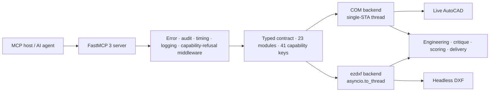

<div align="center">

# AutoCAD MCP Pro

**Production-grade AutoCAD automation for AI agents.**
Live through COM on Windows, or headless through ezdxf anywhere — one typed contract, two engines.

[](https://github.com/U-C4N/Autocad-MCP/actions/workflows/ci.yml)
[](https://pypi.org/project/autocad-mcp-pro/)
[](https://pypi.org/project/autocad-mcp-pro/)
[](https://github.com/U-C4N/Autocad-MCP/blob/main/pyproject.toml)
[](https://github.com/U-C4N/Autocad-MCP/blob/main/LICENSE)

[Install](#install) · [What's new](#whats-new-in-16) · [Tools](#what-you-get) · [Engines](#the-two-engines) · [Evidence](#evidence) · [Limits](#what-this-release-is-bad-at) · [Config](#configuration) · [Changelog](https://github.com/U-C4N/Autocad-MCP/blob/main/CHANGELOG.md)


<sub><b>Not a mockup.</b> Every line on this sheet was drawn by the tools this server exposes — ISO layers, involute gear geometry, DIN 6885 keyway, section A-A, ISO 129 dimensions, an ISO 286 <code>H7</code> bore fit, ISO 7200 title block — then rendered headlessly by <code>view_screenshot</code>. <code>drawing_critique</code> returns <b>0 issues</b> on it. Rebuild it with <code>python scripts/render_readme_showcase.py</code>.</sub>

</div>

> **v1.6 release snapshot:** 247 tools · 8 resources · 5 prompt templates · 4992 collected tests.
> 247 is the **registered** count; a default install advertises 242 over `tools/list`,
> because `ENABLE_3D` is unset. `system_about` is the runtime authority.

## What's new in 1.6

Five tracks of one [roadmap](https://github.com/U-C4N/Autocad-MCP/blob/main/docs/superpowers/specs/2026-09-15-v1.6-roadmap-design.md), 154 → 247 registered tools. Each track has its own design spec, correctness checks that can fail, and a live AutoCAD 2026 run of its COM paths recorded in the [changelog](https://github.com/U-C4N/Autocad-MCP/blob/main/CHANGELOG.md).

| Track | What it adds | Pack |
|---|---|---|
| **P&ID — drafter and reader** | 43 ISO 10628-2 / ISA-5.1 symbols as real blocks with ports and `TAG` attributes, port-to-port lines with ISA-5.1 classes and line numbers, `pid_graph` reading any P&ID back with a confidence per node, instrument index, line list, equipment list, `pid_from_spec` for a whole sheet in one transaction | `pid` |
| **The AutoCAD environment** | ISO-25 / ANSI dimension styles, text and leader styles, `drawing_apply_standard`, ISO 216 / ANSI page setups checked against the plotted PDF's own `/MediaBox`, five bundled templates, several open documents headlessly, portable layer states, named views, UCS, a 90-entry system-variable catalogue; on a live seat, preferences, launch and operator prompts | `core`, `settings` |
| **Mechanical parts and the sheet** | one part model and one view engine (front, side, top, section and detail views with hidden lines, cut faces and ISO 129 dimensions), ISO fasteners and bearings as blocks with attributes, ISO 21920-1 surface texture, ISO 2553 welds, ISO 5457 frames A4–A0, ISO 7200 title blocks, an ISO 7573 parts list read off the drawing with linked ISO 6433 balloons, xrefs, images, real `.dwg` | `mech`, `core` |
| **Architecture** | walls with hosted doors and windows: one engine resolves L / T / X junctions and cuts the openings. Room areas are measured from the faces the walls enclose, and rooms are read back from any plan. Door / window / room schedules are real tables; labels in English or Turkish | `arch` |
| **Understanding and takeoffs** | `drawing_understand` reads a drawing somebody else made in one call. Also `drawing_scale_check`, `drawing_diff` and `drawing_topology_check`. `pipe_takeoff` / `cable_takeoff` take the topology from the P&ID and the lengths from the layout into a Turkish, English or Russian workbook | `core`, `plant` |

`TOOL_PACKS` keeps a client from paying for the tracks it does not use ([idle cost below](#why-this-exists)).

<div align="center">


<sub><b>A mechanical sheet, gated.</b> The <code>mech_assembly</code> benchmark sheet: a hub drawn from its part model with a full section and chain dimensions, a flange with its bolt-circle end view, two ISO 4014 M12×60 bolts and ISO 4032 nuts inserted as blocks, the ISO 7573 parts list <i>read off the drawing</i>, balloons linked to its rows, an ISO 5457 frame and an ISO 7200 title block. <code>drawing_critique(focus=None)</code> returns <b>0 issues</b> and the finalize score is <b>100</b>. Rebuild it with <code>python scripts/render_readme_mech.py</code>.</sub>


<sub><b>A floor plan whose areas nobody typed.</b> <code>arch_plan_from_spec</code>'s example, drawn in one transaction: a 250 mm brick ring split by a 100 mm AAC wall, two doors, two windows, a straight stair and exterior dimension chains at 1:50. The rooms measure 27.74 and 21.99 m², read from the faces the walls enclose, and the door, window and room schedules are read off the drawing. <code>drawing_critique(focus=None)</code> returns <b>0 issues</b>. Rebuild it with <code>python scripts/render_readme_arch.py</code>.</sub>


<sub><b>The same server as a P&ID drafter.</b> <code>pid_from_spec</code> placed five catalogue symbols as real blocks with <code>TAG</code> attributes and named ports and routed four port-to-port lines with ISA-5.1 classes and line numbers, all in one transaction. Then <code>pid_graph</code> read the sheet back: 5 nodes, 4 edges, 0 dangling ends, <code>confidence_min</code> 1.0. Rebuild it with <code>python scripts/render_readme_pid.py</code>.</sub>


<sub><b>The catalogue, authored in code.</b> 43 ISO 10628-2 / ISA-5.1 symbols: 11 valve bodies × 6 actuators, 6 rotating machines, 4 heat exchangers, 6 parametric vessels, 7 inline items, the instrument bubble in 4 types × 5 locations, 5 line markers and 3 connectors. Every one was placed through <code>pid_symbol_insert</code>'s own path. Rebuild it with <code>python scripts/render_pid_catalog.py</code>.</sub>

</div>

## Why this exists

**A big MCP server is expensive to be connected to.** The full catalog costs a client **83,921 tokens** before it has asked for anything. Discovery mode replaces it with two tools and costs **356**.

**A drafter searches for `FILLET`, not `entity_fillet`.** Before the corpus, those command names appeared in no tool name or description. That was `df = 0` against a stock index: the tools were not ranked badly, they were *absent*. The fix was data: an authored corpus of **206 AutoCAD command names and 1439 synonym phrases** covering all 247 tools. A test refuses to let a tool exist without one.

| Advertised surface | Tools seen | Idle cost |
|---|---:|---:|
| `TOOL_PROFILE=full` (default) | 242 | 83,921 tokens |
| `TOOL_PACKS=core,settings` (full profile) | 205 | 63,890 tokens |
| `TOOL_PACKS=core,mech` (full profile) | 197 | 64,836 tokens |
| `TOOL_PACKS=core,arch` (full profile) | 195 | 63,549 tokens |
| `TOOL_PACKS=core,pid` (full profile) | 192 | 60,844 tokens |
| `TOOL_PACKS=core,plant` (full profile) | 185 | 59,290 tokens |
| `TOOL_PACKS=core` (full profile) | 183 | 57,122 tokens |
| `TOOL_PROFILE=lean` | 65 | 22,661 tokens |
| `DISCOVERY_MODE=search` | 2 | **356 tokens** |

> [!NOTE]
> These are offline ratio estimates, not tokenizer counts, and they are the *uncached* cost: prompt caching amortises the idle term. `benchmarks/token_suite.py --tokenizer anthropic` counts for real.

## Install

```bash
pip install autocad-mcp-pro     # or: uvx autocad-mcp-pro
autocad-mcp                     # stdio MCP server, backend auto-selected
```

```bash
AUTOCAD_MCP_BACKEND=ezdxf autocad-mcp    # portable DXF engine, no AutoCAD needed
AUTOCAD_MCP_BACKEND=com   autocad-mcp    # live AutoCAD (needs the [com] extra)
```

| Extra | Pulls in | For |
|---|---|---|
| *(none)* | `fastmcp`, `ezdxf`, `pydantic` | Headless DXF on any OS — **no rendering** |
| `[com]` | `pywin32`, `Pillow` | Live AutoCAD control + window capture |
| `[pdf]` | `matplotlib` | PDF export and headless PNG, any platform |
| `[office]` | `openpyxl` | XLSX workbooks (takeoffs, `data_extract`); CSV is always written |
| `[full]` | everything above | Development and CI |

> [!NOTE]
> The bare install **cannot draw pixels** — `ezdxf.addons.drawing` imports Pillow unconditionally, so every render path needs it. Add `[pdf]` for images on Linux or macOS.

<details>
<summary><b>Wire it to an MCP client</b></summary>

```json
{
  "mcpServers": {
    "autocad": {
      "command": "autocad-mcp",
      "env": {
        "AUTOCAD_MCP_BACKEND": "auto",
        "ALLOWED_PATHS": "C:\\Users\\you\\Documents\\AutoCAD",
        "TOOL_PROFILE": "full",
        "TOOL_PACKS": "all",
        "DISCOVERY_MODE": "off"
      }
    }
  }
}
```

It works with Claude Desktop, Cursor, or any stdio MCP host. For HTTP, run `autocad-mcp --transport http --port 8000`. It binds loopback only, unless remote HTTP is explicitly enabled **and** a bearer token is set.

</details>

## What you get

| Area | What it does |
|---|---|
| Drawing lifecycle | create, open, save, export DXF/PDF, audit *(repairs)*, purge, undo/redo |
| Geometry | lines, arcs, polylines, splines, hatches, trim/extend/fillet/chamfer, handle-preserving edits |
| Annotation | ISO 129 toleranced dimensions, ISO 286 fits (`fit="H7"`, interference shafts r/s/t/u included), TABLE, MLEADER, GD&T frames and datums (ISO 1101) |
| Engineering generators | involute gears (front + section A-A), DIN 6885 keyed bores, ISO A3 title block |
| Mechanical parts | one part model (segments or outline + typed features) and one view engine: front / side / top / section / detail with hidden lines, ISO 128-50 cut faces and ISO 129 dimensions. ISO 4014/4017/4032/7089/4762 fasteners and ISO 15 bearings insert as real blocks with attributes. DIN 471/472, DIN 509, DIN 332 and ISO 3601-2 features have their drawing code, but *their tables ship empty in 1.6* (see [limits](#what-this-release-is-bad-at)). Also ISO 21920-1 surface texture, ISO 2553 welds and ISO 128-40 section lines |
| Sheet & delivery | ISO 5457 frames A4-A0 with zones and trim marks, ISO 7200 title blocks for every size, revision blocks with clouds, ISO 7573 parts lists with ISO 6433 balloons linked by XDATA, CSV/XLSX extraction, xrefs and images on both engines, real `.dwg` on a live seat |
| Architecture | one plan model (walls with hosted doors and windows) and one engine that resolves L / T / X junctions, cuts openings and draws poché by material. Room areas are measured from the faces the walls enclose, never typed, and rooms are read back from any plan with a confidence. Door / window / room schedules are real TABLEs. Also a furniture and sanitary catalogue at nominal sizes, a structural grid, north arrow, section / level / elevation marks, exterior dimension chains, and English or Turkish labels (`lang="tr"`, decimal comma) |
| Understanding & takeoffs | `drawing_understand` reads a drawing somebody else made in one call: declared vs inferred units, robust extents and the outlier behind them, plan copies, each layer's discipline and service in five languages, tags, rooms. `drawing_scale_check` says whether a P&ID is to scale against its layout. `pipe_takeoff` / `cable_takeoff` take the topology from the P&ID and the lengths from the layout (rectilinear MST, statuses A/B/C, power never invented) into a Turkish / English / Russian workbook. `drawing_diff` compares revisions; `drawing_topology_check` finds dangling ends, near misses and crossings |
| P&ID | catalogue blocks with ports and tags (ISO 10628-2 / ISA-5.1), port-to-port lines with ISA-5.1 classes and line numbers, `pid_graph` reads any P&ID back with confidence, instrument index / line list / equipment list, `pid_from_spec` one-call sheets |
| Styles & standards | ISO-25 / ANSI dimension styles, ISOCP / ROMANS text styles, ISO / ANSI leader styles from authored presets; `drawing_apply_standard("iso")` sets all of it plus units and the `mech` layers in one call; `changed` reports only what moved |
| Discovery | `search_tools` ranked over an AutoCAD command and synonym corpus — `FILLET`, `BPOLY`, `QSELECT`, `WBLOCK`, `OVERKILL`, `CHSPACE` each rank **#1** of the 242-tool advertised catalog |
| Batching | `cad_batch` runs a step list in one round trip; `fields=` projects 11 result-heavy tools |
| Paper space | tab lifecycle, viewports, `entity_change_space` (CHSPACE), `drawing_export_pdf(layout=…)` |
| Page setup & templates | ISO 216 / ANSI Y14.1 sheets, ctb catalog, `page_setup_apply` on both engines, and `batch_plot` with every sheet size read back from its PDF's `/MediaBox`. Five bundled templates, built by the server's own tools and pinned reproducible: `drawing_new(template="iso_a3_mech")`, `iso_a1_arch`, `iso_a3_pid`, `ansi_b_mech`, `ansi_d_arch`. Save any drawing as a template (`.dwt` on live AutoCAD; `dwt_write` refused headlessly) |
| Environment | several open documents headlessly, portable layer states (`ACADMCP_LAYERSTATES` XRECORDs — in the file, not in AutoCAD's Layer States Manager), named views, UCS *(tool coordinates stay WCS)*, a system-variable catalog with ranges, document properties. On a live seat: launch/attach, preferences, and an operator prompt / pick / select, where ESC is `cancelled`, not an error |
| Selection | window vs crossing stated back to the caller; a polygon tested against its own shape, not its bounding box |
| Boundaries | `boundary_trace` (BOUNDARY/BPOLY) chains loose edges into one closed polyline, arcs kept as bulges *(headless)* |
| Measurement | `analysis_measure_entity` measures what is *in* the drawing, by handle |
| Hatch depth | gradients, in-place edits, typed edge boundaries *(headless)*, island styles |
| Annotation objects | WIPEOUT, REVCLOUD, MTEXT background masks *(headless)*, text find/replace |
| 3D solids | `solid_box/cylinder/extrude/revolve/boolean` on live AutoCAD (`ENABLE_3D=true`) |
| Quality loop | `drawing_preflight` → `drawing_plan` → `drawing_critique` → `drawing_refine` → `drawing_finalize` (0–100 score); 18 domain critique focuses (P&ID 6, mechanical 6, architecture 3, topology 3), each silent on a drawing outside its domain |
| Delivery | `drawing_deliver`: DXF/PDF/PNG + SHA-256 manifest + reopen-parity checks |

<sub>247 tools in 28 groups. <code>TOOL_PACKS=core</code> hides these from a client that needs none of them: the nine <code>pid_*</code> tools, the 22 environment tools, the 14 mechanical tools, the 12 architectural tools and the two plant takeoffs. <code>TOOL_PACKS=core,mech</code> keeps the mechanical ones, <code>TOOL_PACKS=core,arch</code> the architectural ones, and <code>TOOL_PACKS=core,plant</code> the takeoffs. There are also 8 resources that cost nothing in the tool budget (<code>autocad://drawing/info</code>, <code>layers</code>, <code>blocks</code>, <code>entities/stats</code>, <code>entities/{layer_name}</code>, <code>system/status</code>, <code>pid/symbols</code>, <code>standards/isa51</code>) and 5 prompt templates.</sub>

**Two rules worth knowing.**

- Every coordinate in and out of a tool is WCS on both engines. The one exception is TEXT `rotation`, which stays in the entity frame: a mirrored TEXT is mirror-imaged, and no scalar angle expresses that.
- Never read vertices back and shoelace them. That silently loses **28.2%** of the area on a semicircular edge. `analysis_measure_entity(handle)` reads the real geometry and states its own accuracy.

## The two engines

One contract across 23 modules in `backends/contracts/`. `@capability(key, reason=…)` supplies a default that *refuses*, and a test holds both backends' capability key sets equal. There are **41 capability keys**. Read `system_capabilities` at runtime rather than trusting the table: several depend on what the machine has installed (matplotlib, openpyxl, the ODA File Converter).

| Capability | COM (live AutoCAD) | ezdxf (headless) |
|---|:---:|:---:|
| Live document control | ✅ | — |
| Cross-platform, no AutoCAD | — | ✅ |
| Transactions and rollback | ✅ | ✅ |
| Paper-space layouts + viewports | ✅ | ✅ |
| Viewport model-content rendering | ✅ | ✅ ᵐ *(no borders)* |
| Selection window / crossing / polygon | ✅ | ✅ |
| Entity area by handle | ActiveX `.Area` | Analytic, bulges included |
| HATCH filled area (islands subtracted) | AutoCAD's own number | Loops walked, `hatch_style` reported |
| REGION / 3DSOLID area | ✅ | — *ACIS is opaque to ezdxf* |
| 3D solids | ✅ *with `ENABLE_3D=true`* | — |
| DWG write | ✅ `SaveAs` | via the ODA File Converter, if installed |
| `.dwt` templates | ✅ | DXF only — `dwt_write` refuses |
| Reading a foreign drawing (`drawing_understand`, takeoffs) | ✅ one `Document.Export` snapshot; the document is never renamed | ✅ |
| XLSX workbooks | ✅ ᵒ | ✅ ᵒ |
| Preferences · launch · operator prompts | ✅ | — *refused by name* |
| WIPEOUT · MTEXT background colour | — *verified absent, AutoCAD 2026* | ✅ |
| REVCLOUD · BPOLY · typed hatch edges | — *no ActiveX member* | ✅ |
| CHSPACE | — *unverified on a live seat* | ✅ ᶜ |
| Undo history | ✅ | opt-in — `EZDXF_UNDO_DEPTH` |
| TABLE and MLEADER | Native | Portable composite |
| Screenshots and PDF | Window capture | Matplotlib ᵐ |

<sub>ᵐ Needs matplotlib (<code>[pdf]</code>/<code>[full]</code>). Without it, <code>png</code>, <code>pdf</code>, <code>viewport_render</code> and <code>handle_overlay</code> report unsupported headlessly.<br>
ᵒ Needs openpyxl (<code>[office]</code>/<code>[full]</code>). Without it, XLSX is refused with <code>xlsx_write</code> and CSV is still written.<br>
ᶜ Headless CHSPACE has four restrictions, named in its capability reason: top-view untwisted viewports only; dimensions refused unless frozen; ACIS, proxy and table entities refused; viewport clipping reported rather than applied.</sub>

> [!IMPORTANT]
> Every COM path added in v1.6 was executed against a **live AutoCAD 2026**, one smoke script per track (`scripts/smoke_*_com.py`), each run recorded in the changelog. Those runs found defects no headless test could. ActiveX refuses `entity.Layer` on a missing layer, where ezdxf quietly creates it, so `mech_part_draw` died after drawing every view. ActiveX calls a block reference `BLOCKREFERENCE`, not `INSERT`, so the parts list read nothing. And once pywin32's type-library cache existed, every listed entity arrived as a bare `IAcadEntity` with no line endpoints, so the room reader saw no walls and `arch_plan_from_spec` refused its first room label.

## Evidence

Everything below is produced by scripts in [`benchmarks/`](https://github.com/U-C4N/Autocad-MCP/blob/main/benchmarks/) and published as JSON under [`benchmarks/results/published/`](https://github.com/U-C4N/Autocad-MCP/tree/main/benchmarks/results/published).

### Against the other AutoCAD MCP servers


A fixed 100-point rubric applied to nine public AutoCAD MCP servers ([`source_review.json`](https://github.com/U-C4N/Autocad-MCP/blob/main/benchmarks/source_review.json)). Stars and raw tool counts score nothing. 1.6.0 is scored **per category, with the evidence for every point withheld**:

| Category | Weight | 1.6.0 | Points withheld for |
|---|---:|---:|---|
| Functional CAD coverage | 25 | 24 | no electrical schematics, image-to-CAD tracing, Plant 3D, obstacle-avoiding routing or headless REGION / 3DSOLID |
| Correctness and delivery | 20 | 19 | a headless DIMENSION does not re-render; a takeoff on a real P&ID still needs the engineer's scope decisions |
| Backends and platforms | 15 | 14 | BricsCAD, ZWCAD and GstarCAD unverified |
| Engineering production | 15 | 14 | four DIN / ISO feature tables ship empty |
| Tests and maintenance | 15 | 14 | headless entity creation slower than v1.4.0 |
| Security and operations | 10 | 8 | `ALLOWED_PATHS` unscoped by default; command filtering is a denylist |
| **Total** | **100** | **93** | |

> [!NOTE]
> Read this as a documented self-assessment, not an independent review: this repository applies the rubric to itself and to the others. The competitor rows are their July 2026 snapshots and were not re-reviewed for this release, and the best of them, varavista/autocad-mcp, scored 84. 1.4.0 was given one overall 95. This review is stricter and scores each category apart.

A second lane runs tasks instead of reading source. Every task in the fixed-task matrix can fail, and its artifacts are verified by re-opening the DXF, never by trusting a response. The reference adapter passes **21 / 21** of matrix v7. The two competitors with adapters, pinned at their July 2026 commits, passed 5 / 10 and 4 / 10 of the ten v2 tasks they were run on. The eleven tasks added since then were never put to them, so they show as *not run*, not as zero:


### Correctness — every release re-proves itself

48 deterministic headless checks against the previous tag and the current tree. Each runs in its own subprocess, so a hard crash counts as a miss rather than killing the run.

| Version | Checks passing | Pass rate | Fixed | Regressed |
|---|---:|---:|---:|---:|
| v1.5.1 *(baseline)* | 26 / 48 | 54.2 % | — | — |
| **v1.6.0** *(this release)* | **48 / 48** | **100 %** | 22 | **0** |

The 26 checks v1.5.1 was released on all still pass. The twenty-two fixed rows are new capability (`miss → pass`), and each one pins a number computed by hand, not read back from the code that drew it:

<details>
<summary><b>The twenty-two checks 1.6 added</b></summary>

| Track | Check | Verified against |
|---|---|---|
| Understanding | `scale_check_detects_schematic` | the synthetic P&ID reads **schematic** against its layout; a uniform 2× copy of six tags reads **to scale** with factor 2 |
| | `pipe_takeoff_rmst_exact` | all eight routable runs measure exactly the rectilinear MST of their tags |
| | `cable_takeoff_roundup` | 9, 17, 19 and 10 m after the 20 % allowance; the heater's unstated power stays empty |
| | `diff_detects_known_edits` | a move, a text change, an attribute change, an add and a delete, and nothing else |
| | `topology_known_defects` | a 5 mm near miss, one interior crossing, and a clean T that is neither |
| Architecture | `arch_junction_l_t_x` | an L corner mitres at (4100, −100) / (3900, 100), a T stem stops on the near face, an X cuts all four faces; wall areas 1 400 000, 1 490 000 and 2 360 000 mm² |
| | `arch_room_area_net` | a 4 × 5 m room between 200 mm walls is labelled 20.00 m², not the 21.84 m² its axes enclose |
| | `arch_opening_cuts_wall` | both faces are interrupted across a 900 door and two jambs close it |
| | `arch_rooms_detect_foreign` | plain lines on a `WALLS` layer yield 20 and 15 m² at confidence 0.6, and nothing is written |
| Mechanical and sheet | `mech_part_roundtrip` | a part read back out of its own `ACADMCP_MECH` XDATA equals the part drawn |
| | `mech_section_hatch_area` | a 60 × ⌀40 sleeve with a ⌀20 bore cuts 1200 mm², measured out of the drawing by `analysis_measure_entity` |
| | `mech_iso286_on_dimension` | 40 H7 is +0.025 / 0 and survives the layout |
| | `mech_thread_unrepresented_is_caught` | the ISO 6410 focus fires on a thread drawn as a plain circle. A gate that never fires is not a gate |
| | `std_part_iso4014_m12` | s = 18, k = 7.5, read by value |
| | `sheet_frame_iso5457_a3` | the frame runs 20,10 to 410,287 inside the 420 × 297 sheet |
| | `bom_balloon_link` | two identical bolts are one row of quantity 2, and its balloon carries the row's item number |
| Environment | `settings_dimstyle_iso25_values` | the ISO-25 preset lands in the DIMSTYLE table with ISO 129-1's numbers |
| | `settings_layer_state_roundtrip` | save → change → restore puts the layer table back, and the state survives save/reopen |
| | `settings_pdf_mediabox_a3` | the plotted PDF's own `/MediaBox` reads 420 × 297 |
| P&ID | `pid_block_define_attdef_roundtrip`, `pid_tag_parse_fic`, `pid_graph_edge_count` | a block with ATTDEFs defined and read back, an ISA-5.1 tag parsed, a drawn P&ID's edge count |

</details>

### The task matrix — tasks that can fail

An earlier matrix scored this server 10/10, which carried no information: every task in it exercised something the server was built around. Five tasks were added in 1.5 because they *can* fail, and three of them did while being written. 1.6 adds six more:

- one the P&ID reader can fail on its own;
- one where the PDF file, not the setter, is the witness;
- one where a whole mechanical sheet has to come out clean;
- one where a floor plan's rooms are read back off the drawing;
- two where a foreign plant's P&ID and layout are read: the takeoffs against lengths computed in advance, and the one-call report against the defects planted in it.

| Task | Verified against |
|---|---|
| `tool_discovery` | six AutoCAD command names, each ranking #1 |
| `token_budget` | 83,921 → 356 tokens, against a ceiling fixed in advance |
| `hatch_islands` | 300 filled with the island, 400 ignoring it |
| `selection_filter` | window 1, crossing 2, bounding box 3, polygon 1 |
| `measure_from_handle` | 139.2699 against the 100.0 a vertex shoelace gives |
| `pid_roundtrip` | the example sheet drawn by `pid_from_spec`, read back by `pid_graph`, which never sees the spec: 5 nodes, 4 edges, 0 dangling, `confidence_min` 1.0, `FIC-101` wired to `FCV-101` |
| `page_setup_truth` | ANSI B, then ISO A3 landscape, applied to Layout1. Each is plotted through `batch_plot` and read back from its PDF's `/MediaBox`: 432 × 279, then 420 × 297 mm, not the setter's return value. A fresh layout is already A3, so the B sheet is what a no-op setter cannot fake |
| `mech_assembly` | a flange-coupling A3 sheet: a hub with a full section, a flange with its bolt-circle end view, two ISO 4014 bolts with ISO 4032 nuts, an ISO 7573 parts list read off the drawing, linked balloons, an ISO 5457 frame and an ISO 7200 title block. Gated on `drawing_critique(focus=None)` returning **zero** issues and a finalize score of at least **90**; a test drops one balloon and watches the gate fail |
| `arch_roundtrip` | a two-room plan (an entrance door, an interior door, two windows, a stair) drawn by `arch_plan_from_spec` and read back by `arch_rooms_detect`, which never sees the spec. Each room must be within 0.1 % of its label and of the net floor computed by hand (4825 × 5750 and 3825 × 5750 mm), and the schedules must list D1, D2, W1, W2. Gated like `mech_assembly`; a test removes one room label and watches the gate fail |
| `takeoff_roundtrip` | the synthetic plant pair: a P&ID stretched 1.3× in one room and rearranged in the other, Russian supply / return words, a return drawn on the supply layer, a reducer, a segment drawn twice. The scale check must call it **schematic** (21.8 % of 55 pairs within ±10 %). `pipe_takeoff` must give every routable run's layout length equal to the rectilinear MST of its tags, sizes and services as drawn, and the run to a tag the layout lacks status C. `cable_takeoff` must give 9 / 17 / 19 / 10 m after the 20 % allowance and leave the heater's power empty. A test removes the wiring callouts and watches the cable half fail by name |
| `understand_foreign` | the pair's layout (inches declared over millimetres, a stray line 5,000 km out, two plan copies) comes back as millimetres with an `INSUNITS` warning, the stray line's handle and two clusters. The P&ID's `P_product piping` / `P_cipsupplyline` / `P_cipreturnline` / `P_ijswater` / `E_power` classify as product / CIP supply / CIP return / ice water / electrical. A test makes the layout declare millimetres and watches the units gate fail |

### Headless performance


The workloads call the same backend methods the MCP tools call, so server-side overhead is included. Numbers move with hardware; the report records the machine fingerprint. **Read the next section before quoting them.** This release is slower than v1.4.0 at creating entities.

## What this release is bad at

A page that only lists strengths is a page that has not been measured.

**Headless entity creation is slower than v1.4.0, and 1.6 did not win it back.** These are medians of five alternating runs on one machine, with one interpreter (CPython 3.11.15) and one ezdxf, v1.4.0's code against 1.6.0's ([`perf-v1.4.0-vs-v1.6.0.json`](https://github.com/U-C4N/Autocad-MCP/blob/main/benchmarks/results/published/perf-v1.4.0-vs-v1.6.0.json)):

| Workload | v1.4.0 | v1.6.0 | v1.6.0, `EZDXF_CALL_TIMEOUT=0` |
|---|---:|---:|---:|
| 2,000 lines, one call each | 244.5 ms | 306.1 ms (1.25×) | 284.9 ms (1.17×) |
| 10,000 lines: build, DXF export, reopen | 1,847.9 ms | 2,553.5 ms (1.38×) | 2,216.4 ms (1.20×) |
| Region query over 10,000 entities | 665.2 ms | 712.2 ms (1.07×) | 783.9 ms (1.18×) |
| Premium quality pass | 150.6 ms | 65.3 ms (**2.3× faster**) | 69.9 ms |

The per-call timeout stops one hung call from wedging a server whose document lock is a single `asyncio.Lock`. It explains only part of the slowdown: switched off, creation is still 1.17× and 1.20× slower. The rest is extra work per call that 1.6 has not removed. A cProfile of the event-loop thread counts 491,071 function calls for the 2,000 creates, against v1.4.0's 319,038. Earlier READMEs said that switching the timeout off returned creation to v1.4.0's numbers. Measured this way, it does not. The region-query row, which moves the wrong way, shows this machine's noise floor (about ±10 %). Roadmap criterion 7 is not met and moves to 1.7.

**Four mechanical feature tables ship empty.** DIN 471/472 retaining-ring grooves, DIN 509 undercuts, DIN 332 centre holes and ISO 3601-2 O-ring grooves have their drawing code and their provenance tests, but no rows. A groove diameter written from memory is a wrong workshop drawing, while a narrow table is merely narrow. So every size is refused by name until rows verified against the standard's own table are transcribed. That is a data edit; each module's docstring says how.

**Takeoffs are estimates, and they say so.**

- A layout length is the rectilinear minimum spanning tree of the tags a run connects, plus a stated vertical allowance, and it is labelled an estimate.
- A P&ID length is used only when `drawing_scale_check` calls the P&ID to scale.
- A power the P&ID does not state stays empty and becomes an open item, and no cable-section table is authored: a section comes only from your `section_rules`.
- Where no callout names a panel, the nearest panel is inferred and flagged.
- Detail copies of equipment are flagged, and excluded only when you ask.

The readers were tuned on the synthetic plant pair and on one real P&ID / layout pair that is not in this repository. Another drafting office's layer and text conventions may need vocabulary.

**No Plant 3D.** The roadmap's track D (read-only queries of a Plant 3D project) was dropped: the maintainer does not use Plant 3D, and a reader tested against nobody's real projects would be a guess. Roadmap criterion 5 is withdrawn, not met.

**No REGION or 2D booleans headlessly.** `add_region()` produces a REGION with **zero ACIS bytes**, and the `greiner_hormann` substitute loses **28.2%** of the area on a square with one semicircular edge.

**`system_run_command` / `system_run_lisp` are a guardrail, not a security boundary.** The rejection message says so in those words. A 36-verb denylist refuses the obvious cases, but AutoCAD accepts hundreds of commands, and `DANGEROUS_COMMANDS_ENABLED=true` switches the list off entirely.

**Path validation is per-tool, and unscoped until you scope it.** With `ALLOWED_PATHS` empty (the default), the only positive bound is a ten-entry system-directory denylist that does not include `C:/Users`, `/home`, `/root` or `/var`. **Set `ALLOWED_PATHS`.**

**Non-AutoCAD ProgIDs are unverified.** `CAD_PROGID` changes which COM application the backend attaches to; nothing beyond the connection has been tested against BricsCAD, ZWCAD or GstarCAD.

### Known limitations of the P&ID track

**The router is orthogonal and blind.** `pid_line_draw` picks `auto` from seven orthogonal candidates, by fewest bends then length:

- straight;
- one bend;
- two bends through the midline;
- a stub out of each port joined by three bends.

You can also take `direct`, or pass waypoints. It *counts* the lines it crosses (`crossings` comes back in every result, and `pid_from_spec` sums it), but it does not route around them. Obstacle-avoiding routing is not in 1.6; move the symbol or pass waypoints.

**A foreign drawing is read at the confidence it earns, and no higher.** A block this server did not place classifies at 0.6, with inferred ports, by its `TAG`-style attribute or a keyword in its name. It classifies at 0.3 when a line merely touches it, and a 0.3 guess can neither raise nor suppress a critique finding.

On the live engine, an INSERT turned off a right angle has members ActiveX cannot measure, so it reports an *approximate* box. `pid_graph` takes the tighter wall of that box and the attribute-inclusive box on every side. Even so, a line ending on such a body's true edge can still be reported `dangling`, with the nearest port as the hint. Read `stats.confidence_min` first.

**Same-file only, DXF headlessly.** Off-page connectors link within one drawing; links across files are not resolved. The headless engine reads DXF; a DWG P&ID is read through the live backend. There is no DEXPI/Proteus export and there are no ISA-5.2 binary-logic symbols in this release. Both cuts are recorded in the spec so nobody re-derives them.

### Known limitations of the settings track

**Layer states are ours.** `layer_state_save` writes a portable snapshot into an `ACADMCP_LAYERSTATES` XRECORD. It survives save/reopen on both engines and travels with the DWG/DXF. It is **not** an AutoCAD `LAYERSTATE` and does not appear in the Layer States Manager, which is why `system_capabilities` reports `layer_states` as `mode: "xrecord"`.

**Six of the 22 environment tools need a live seat.** Preferences, launching, the operator prompts and the five summary fields of document properties are refused headlessly with `preferences` / `dwgprops` / `live_application` / `interactive_prompt`. Each is a refusal, not a stub.

A `.dwt` template is the same case (`dwt_write`): a `.dwt` is a DWG container, so headlessly the template is saved as DXF. `mleaderstyle_create` is *not* such a case. ActiveX has no MLeaderStyle collection, but the `ACAD_MLEADERSTYLE` dictionary holds full `IAcadMLeaderStyle` objects, so both engines create leader styles.

**A headless dimension does not re-render.** On the ezdxf engine, `dimstyle_modify` reports `dimensions_using_style` and `rerender_required: true`, and the DIMENSION keeps its rendered block until it is redrawn. AutoCAD regenerates on the next regen.

### Known limitations of the architecture track

**Nominal, not standard.** The furniture and sanitary blocks carry nominal catalogue sizes and say so. The stair tool reports the Blondel relation (2R + G within 600–650 mm) as a design rule, never as a building code. The `arch` layer colours are a repository convention: ISO 13567 fixes the names, not the colours. Labels speak English or Turkish; any other `lang` is refused with the list.

## Configuration

Nothing loads a `.env` file — export these, or set them in your MCP client's `env` block.

<details>
<summary><b>All 17 environment variables</b></summary>

| Variable | Default | Purpose |
|---|---|---|
| `AUTOCAD_MCP_BACKEND` | `auto` | `auto`, `com`, or `ezdxf` |
| `CAD_PROGID` | `AutoCAD.Application` | COM ProgID the live backend attaches to |
| `TOOL_PROFILE` | `full` | `lean` (65 curated tools, 55 with `TOOL_PACKS=core`) or `full` |
| `TOOL_PACKS` | `all` | Vertical packs to advertise: `core,pid,settings,mech,arch,plant` (`core` always on) |
| `DISCOVERY_MODE` | `off` | `search` replaces the catalog with `search_tools` + `call_tool` |
| `ENABLE_3D` | `false` | Expose the opt-in `solid_*` tools (COM) |
| `LOG_LEVEL` | `INFO` | Python logging level |
| `ALLOWED_PATHS` | *(empty)* | Comma-separated absolute paths the server may access |
| `MAX_UNDO_STACK` | `5` | Maximum retained undo snapshots |
| `EZDXF_UNDO_DEPTH` | `0` | Headless undo history depth; `0` disables it |
| `MAX_DXF_BYTES` | `536870912` | Reject larger DXF input (512 MB); `0` disables |
| `MAX_LIST_LIMIT` | `5000` | Bound list/selection response sizes |
| `COM_CALL_TIMEOUT` | `60` | Per-call live AutoCAD timeout (s); `0` disables |
| `EZDXF_CALL_TIMEOUT` | `120` | Per-call headless timeout (s); `0` disables |
| `DANGEROUS_COMMANDS_ENABLED` | `false` | Allow blocked commands/LISP; reported as unsafe mode |
| `ALLOW_REMOTE_HTTP` | `false` | Permit a non-loopback HTTP bind |
| `MCP_AUTH_TOKEN` | *(empty)* | Bearer token required for remote HTTP |

</details>

## Architecture



<details>
<summary><b>The drawing at the top of this page, as tool calls</b></summary>

The sequence in [`scripts/render_readme_showcase.py`](https://github.com/U-C4N/Autocad-MCP/blob/main/scripts/render_readme_showcase.py), which produced the hero sheet:

```text
drawing_new()                                    ISO linetypes + layers bootstrapped
drawing_apply_iso_layers("mech")                 ISO 128 lineweights per layer
drawing_settings({units: "mm", linear_precision: 2})

gear_draw_spur_front_view(                       involute flanks, not a decorated circle
    module=6, teeth=24, center=[135, 172],
    bore_diameter=40, keyway_width=12, keyway_depth=3.3)
gear_draw_section_aa(x_offset=300, face_width=46)

dimension_linear(...)                            ISO 129
dimension_diameter(..., fit="H7")                deviations from authored ISO 286 tables
titleblock_apply_iso_a3(title="SPUR GEAR m6 z24", material="C45E", ...)

drawing_critique(focus=None)                     -> []  must be empty before finalize
view_screenshot()                                -> PNG
```

The full production loop adds `drawing_preflight` and `drawing_plan` at the front, `drawing_refine` after the critique, and `layout_create` + `viewport_create` + `drawing_deliver` at the end.

</details>

## Development

```bash
uv sync --locked --all-extras
uv run pytest
uv run ruff check . && uv run ruff format --check .
```

`uv.lock` pins the whole transitive graph, so this reproduces CI exactly. CI runs Linux (3.11 / 3.12) and Windows (mocked COM), plus package, Docker and MCP-registry jobs. The release gate runs the same three test lanes before anything reaches PyPI. Releases are tag-driven: `git tag vX.Y.Z && git push origin vX.Y.Z`.

## Roadmap (1.7)

- **Speed.** Win back the headless creation throughput that 1.6 lost against v1.4.0 (criterion 7): arm the per-call timeout only where a call can block, and remove the per-call work that came with it.
- **IEC 60617 electrical schematics.** They reuse the P&ID track's symbol, port and graph machinery.
- **Transcribed rows** for DIN 471/472, DIN 509, DIN 332 and ISO 3601-2, each verified against the standard's own table.
- **HATCH boundary geometry in `entity_get`.** 1.5 and 1.6 measure a hatch's filled area but do not hand back its loops.
- **`ezdxf.recover` as a fallback** on `drawing_open`.
- **An allowlist of permitted AutoLISP heads**, replacing the denylist. Enumerating dangerous symbols does not terminate.

Features ship when their contracts and limitations are testable — not when they make a longer checklist.

## Star History

[](https://www.star-history.com/#U-C4N/U-Pool&U-C4N/Autocad-MCP&Date&legend=top-left)

## Author

**Umutcan Edizsalan** · Mechanical engineering work at **Anka-Makine** · GitHub [@U-C4N](https://github.com/U-C4N)

Built from production drawing work, then made model-agnostic through MCP.

## License

[MIT](https://github.com/U-C4N/Autocad-MCP/blob/main/LICENSE)

<!-- MCP registry ownership marker; must equal the "name" in server.json. -->
mcp-name: io.github.u-c4n/autocad-mcp
