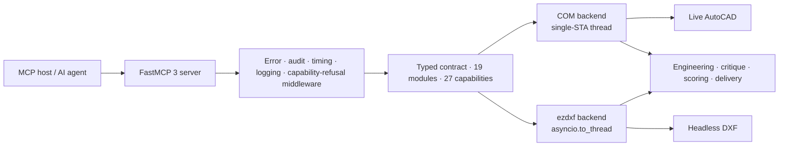

<div align="center">

# AutoCAD MCP Pro

**Production-grade AutoCAD automation for AI agents.**
Live through COM on Windows, or headless through ezdxf anywhere — one typed contract, two engines.

[](https://github.com/U-C4N/Autocad-MCP/actions/workflows/ci.yml)
[](https://pypi.org/project/autocad-mcp-pro/)
[](https://pypi.org/project/autocad-mcp-pro/)
[](https://github.com/U-C4N/Autocad-MCP/blob/main/pyproject.toml)
[](https://github.com/U-C4N/Autocad-MCP/blob/main/LICENSE)

[Install](#install) · [Tools](#what-you-get) · [Engines](#the-two-engines) · [Evidence](#evidence) · [Limits](#what-this-release-is-bad-at) · [Config](#configuration) · [Changelog](https://github.com/U-C4N/Autocad-MCP/blob/main/CHANGELOG.md)


<sub><b>Not a mockup.</b> Every line on this sheet was drawn by the tools this server exposes — ISO layers, involute gear geometry, DIN 6885 keyway, section A-A, ISO 129 dimensions, an ISO 286 <code>H7</code> bore fit, ISO 7200 title block — then rendered headlessly by <code>view_screenshot</code>. <code>drawing_critique</code> returns <b>0 issues</b> on it. Rebuild it with <code>python scripts/render_readme_showcase.py</code>.</sub>


<sub><b>The same server as a P&ID drafter.</b> <code>pid_from_spec</code> placed five catalogue symbols as real blocks with <code>TAG</code> attributes and named ports, routed four port-to-port lines with ISA-5.1 classes and line numbers in one transaction, then <code>pid_graph</code> read the sheet back: 5 nodes, 4 edges, 0 dangling ends, <code>confidence_min</code> 1.0. Rebuild it with <code>python scripts/render_readme_pid.py</code>.</sub>


<sub><b>The catalogue, authored in code.</b> 43 ISO 10628-2 / ISA-5.1 symbols — 11 valve bodies × 6 actuators, 6 rotating machines, 4 heat exchangers, 6 parametric vessels, 7 inline items, the instrument bubble in 4 types × 5 locations, 5 line markers, 3 connectors — every one placed through <code>pid_symbol_insert</code>'s own path. Rebuild it with <code>python scripts/render_pid_catalog.py</code>.</sub>

</div>

> **v1.5 release snapshot:** 229 tools · 8 resources · 5 prompt templates · 4005 collected tests.
> 229 is the **registered** count; a default install advertises 224 over `tools/list`,
> because `ENABLE_3D` is unset. `system_about` is the runtime authority.

## Why this exists

**A big MCP server is expensive to be connected to.** The full catalog costs a client **72,163 tokens** before it has asked for anything. Discovery mode replaces it with two tools and costs **356**.

**A drafter searches for `FILLET`, not `entity_fillet`.** Those command names appeared in no tool name or description — `df = 0` against a stock index, not badly ranked but *absent*. The fix was data: an authored corpus of **197 AutoCAD command names and 1158 synonym phrases** covering all 229 tools. A test refuses to let a tool exist without one.

| Advertised surface | Tools seen | Idle cost |
|---|---:|---:|
| `TOOL_PROFILE=full` (default) | 224 | 72,163 tokens |
| `TOOL_PACKS=core,settings` (full profile) | 201 | 60,727 tokens |
| `TOOL_PACKS=core,mech` (full profile) | 193 | 61,673 tokens |
| `TOOL_PACKS=core` (full profile) | 179 | 53,959 tokens |
| `TOOL_PROFILE=lean` | 60 | 19,484 tokens |
| `DISCOVERY_MODE=search` | 2 | **356 tokens** |

> [!NOTE]
> Offline ratio estimates, not tokenizer counts, and the *uncached* ratio — prompt caching amortises the idle term. `benchmarks/token_suite.py --tokenizer anthropic` counts for real.

## Install

```bash
pip install autocad-mcp-pro     # or: uvx autocad-mcp-pro
autocad-mcp                     # stdio MCP server, backend auto-selected
```

```bash
AUTOCAD_MCP_BACKEND=ezdxf autocad-mcp    # portable DXF engine, no AutoCAD needed
AUTOCAD_MCP_BACKEND=com   autocad-mcp    # live AutoCAD (needs the [com] extra)
```

| Extra | Pulls in | For |
|---|---|---|
| *(none)* | `fastmcp`, `ezdxf`, `pydantic` | Headless DXF on any OS — **no rendering** |
| `[com]` | `pywin32`, `Pillow` | Live AutoCAD control + window capture |
| `[pdf]` | `matplotlib` | PDF export and headless PNG, any platform |
| `[full]` | everything above | Development and CI |

> [!NOTE]
> The bare install **cannot draw pixels** — `ezdxf.addons.drawing` imports Pillow unconditionally, so every render path needs it. Add `[pdf]` for images on Linux or macOS.

<details>
<summary><b>Wire it to an MCP client</b></summary>

```json
{
  "mcpServers": {
    "autocad": {
      "command": "autocad-mcp",
      "env": {
        "AUTOCAD_MCP_BACKEND": "auto",
        "ALLOWED_PATHS": "C:\\Users\\you\\Documents\\AutoCAD",
        "TOOL_PROFILE": "full",
        "DISCOVERY_MODE": "off"
      }
    }
  }
}
```

Claude Desktop, Cursor, or any stdio MCP host. For HTTP: `autocad-mcp --transport http --port 8000` — loopback only unless remote HTTP is explicitly enabled **and** a bearer token is set.

</details>

## What you get

| Area | What it does |
|---|---|
| Drawing lifecycle | create, open, save, export DXF/PDF, audit *(repairs)*, purge, undo/redo |
| Geometry | lines, arcs, polylines, splines, hatches, trim/extend/fillet/chamfer, handle-preserving edits |
| Annotation | ISO 129 toleranced dimensions, ISO 286 fits (`fit="H7"`), TABLE, MLEADER, GD&T frames and datums (ISO 1101) |
| Engineering generators | involute gears (front + section A-A), DIN 6885 keyed bores, ISO A3 title block |
| Mechanical parts | one part model (segments or outline + typed features) and one view engine: front / side / top / section / detail with hidden lines, ISO 128-50 cut faces and ISO 129 dimensions; ISO 4014/4017/4032/7089/4762 fasteners, ISO 15 bearings, DIN 471/472, DIN 509, DIN 332 and ISO 3601-2 as real blocks with attributes; ISO 21920-1 surface texture, ISO 2553 welds, ISO 128-40 section lines |
| Sheet & delivery | ISO 5457 frames A4-A0 with zones and trim marks, ISO 7200 title blocks for every size, revision blocks with clouds, ISO 7573 parts lists with ISO 6433 balloons linked by XDATA, CSV/XLSX extraction, xrefs and images on both engines, real `.dwg` on a live seat |
| P&ID | catalogue blocks with ports and tags (ISO 10628-2 / ISA-5.1), port-to-port lines with ISA-5.1 classes and line numbers, `pid_graph` reads any P&ID back with confidence, instrument index / line list / equipment list, `pid_from_spec` one-call sheets |
| Styles & standards | ISO-25 / ANSI dimension styles, ISOCP / ROMANS text styles, ISO / ANSI leader styles from authored presets; `drawing_apply_standard("iso")` sets all of it plus units and the `mech` layers in one call; `changed` reports only what moved |
| Discovery | `search_tools` ranked over an AutoCAD command and synonym corpus — `FILLET`, `BPOLY`, `QSELECT`, `WBLOCK`, `OVERKILL`, `CHSPACE` each rank **#1** of the 224-tool advertised catalog |
| Batching | `cad_batch` runs a step list in one round trip; `fields=` projects 11 result-heavy tools |
| Paper space | tab lifecycle, viewports, `entity_change_space` (CHSPACE), `page_setup_apply` (ISO 216 / ANSI Y14.1 paper, ctb, scale, device — on both engines), `batch_plot` with every sheet size read back from its PDF's `/MediaBox`, `drawing_export_pdf(layout=…)` |
| Page setup & templates | ISO 216 / ANSI Y14.1 sheets, ctb catalog, `batch_plot` verified by the PDF's own `/MediaBox`, five bundled templates built by the server's own tools and pinned reproducible (`drawing_new(template="iso_a3_mech")`, `iso_a1_arch`, `iso_a3_pid`, `ansi_b_mech`, `ansi_d_arch`), save any drawing as a template (`.dwt` on live AutoCAD, `dwt_write` refused headlessly) |
| Environment | several open documents headlessly, portable layer states (`ACADMCP_LAYERSTATES` XRECORDs — in the file, not in AutoCAD's Layer States Manager), named views, UCS *(tool coordinates stay WCS)*, a system-variable catalog with ranges, document properties, and on a live seat: launch/attach, preferences, an operator prompt / pick / select — where ESC is `cancelled`, not an error |
| Selection | window vs crossing stated back to the caller; a polygon tested against its own shape, not its bounding box |
| Boundaries | `boundary_trace` (BOUNDARY/BPOLY) chains loose edges into one closed polyline, arcs kept as bulges *(headless)* |
| Measurement | `analysis_measure_entity` measures what is *in* the drawing, by handle |
| Hatch depth | gradients, in-place edits, typed edge boundaries *(headless)*, island styles |
| Annotation objects | WIPEOUT, REVCLOUD, MTEXT background masks *(headless)*, text find/replace |
| 3D solids | `solid_box/cylinder/extrude/revolve/boolean` on live AutoCAD (`ENABLE_3D=true`) |
| Quality loop | `drawing_preflight` → `drawing_plan` → `drawing_critique` → `drawing_refine` → `drawing_finalize` (0–100 score) |
| Delivery | `drawing_deliver`: DXF/PDF/PNG + SHA-256 manifest + reopen-parity checks |

<sub>229 tools in 25 groups; <code>TOOL_PACKS=core</code> hides the nine <code>pid_*</code> tools, the 22 environment tools and the 14 mechanical tools (<code>TOOL_PACKS=core,mech</code> keeps the last) from a client that needs none of them. Plus 8 resources that cost nothing in the tool budget (<code>autocad://drawing/info</code>, <code>layers</code>, <code>blocks</code>, <code>entities/stats</code>, <code>entities/{layer_name}</code>, <code>system/status</code>, <code>pid/symbols</code>, <code>standards/isa51</code>) and 5 prompt templates.</sub>

**Two rules worth knowing.** Every coordinate in and out of a tool is WCS on both engines — the one exception is TEXT `rotation`, which stays in the entity frame because a mirrored TEXT is mirror-imaged and no scalar angle expresses that. And never read vertices back and shoelace them: that loses **28.2%** of the area on a semicircular edge, silently. `analysis_measure_entity(handle)` reads the real geometry and states its own accuracy.

## The two engines

One contract across 19 modules in `backends/contracts/`. `@capability(key, reason=…)` supplies a default that *refuses*, and a test holds both backends' capability key sets equal. There are **27 capability keys**; read `system_capabilities` at runtime rather than trusting the table — five of them depend on how the machine is set up.

| Capability | COM (live AutoCAD) | ezdxf (headless) |
|---|:---:|:---:|
| Live document control | ✅ | — |
| Cross-platform, no AutoCAD | — | ✅ |
| Transactions and rollback | ✅ | ✅ |
| Paper-space layouts + viewports | ✅ | ✅ |
| Viewport model-content rendering | ✅ | ✅ ᵐ *(no borders)* |
| Selection window / crossing / polygon | ✅ | ✅ |
| Entity area by handle | ActiveX `.Area` | Analytic, bulges included |
| HATCH filled area (islands subtracted) | AutoCAD's own number | Loops walked, `hatch_style` reported |
| REGION / 3DSOLID area | ✅ | — *ACIS is opaque to ezdxf* |
| 3D solids | ✅ *with `ENABLE_3D=true`* | — |
| DWG write | ✅ | — |
| WIPEOUT · MTEXT background colour | — *verified absent, AutoCAD 2026* | ✅ |
| REVCLOUD · BPOLY · typed hatch edges | — *no ActiveX member* | ✅ |
| CHSPACE | — *unverified on a live seat* | ✅ ᶜ |
| Undo history | ✅ | opt-in — `EZDXF_UNDO_DEPTH` |
| TABLE and MLEADER | Native | Portable composite |
| Screenshots and PDF | Window capture | Matplotlib ᵐ |

<sub>ᵐ Needs matplotlib (<code>[pdf]</code>/<code>[full]</code>); without it <code>png</code>, <code>pdf</code>, <code>viewport_render</code> and <code>handle_overlay</code> report unsupported headlessly.<br>
ᶜ Headless CHSPACE carries four named restrictions in its capability reason: top-view untwisted viewports only, dimensions refused unless frozen, ACIS/proxy/table refused, viewport clipping reported rather than applied.</sub>

> [!IMPORTANT]
> Every COM path added in v1.5 was executed against a **live AutoCAD 2026**. That run found four defects reading could not — the largest being that `AcadPViewport` has no `ViewCenter` member, so the line setting it had been silently swallowed by a bare `except` since v1.4.

## Evidence

Self-measurement, produced by scripts in [`benchmarks/`](https://github.com/U-C4N/Autocad-MCP/blob/main/benchmarks/).

### Correctness — every release re-proves itself

39 deterministic headless checks against the previous tag and the current tree, each in its own subprocess so a hard crash counts as a miss rather than killing the run.

| Version | Checks passing | Pass rate | Fixed | Regressed |
|---|---:|---:|---:|---:|
| v1.5.1 *(baseline)* | 26 / 39 | 66.7 % | — | — |
| **v1.6.0-dev** *(this branch)* | **39 / 39** | **100 %** | 13 | **0** |

The thirteen fixed rows are new capability (`miss → pass`). Tracks B and G add seven: `mech_part_roundtrip` (a part read back out of its own `ACADMCP_MECH` XDATA equals the part drawn), `mech_section_hatch_area` (a 60 x ⌀40 sleeve with a ⌀20 bore cuts 1200 mm² exactly, measured out of the drawing by `analysis_measure_entity`), `mech_iso286_on_dimension` (40 H7 is +0.025 / 0 and survives the layout), `mech_thread_unrepresented_is_caught` (the ISO 6410 focus fires on a thread drawn as a plain circle — a gate that never fires is not a gate), `std_part_iso4014_m12` (s = 18, k = 7.5, read by value), `sheet_frame_iso5457_a3` (the frame runs 20,10 to 410,287 inside the 420 × 297 sheet) and `bom_balloon_link` (two identical bolts are one row of quantity 2, and its balloon carries the row's item number). The other six are the three P&ID checks of track A and, from track E, `settings_dimstyle_iso25_values` (the ISO-25 preset lands in the DIMSTYLE table with ISO 129-1's numbers), `settings_layer_state_roundtrip` (save → change → restore puts the layer table back, and the state survives save/reopen because it is an XRECORD in the file) and `settings_pdf_mediabox_a3` (the plotted PDF's own `/MediaBox` reads 420 × 297). The 26 checks v1.5.1 was gated on all still pass. Against the older `v1.4.0` baseline the same 26 reported **21 / 26 → 26 / 26, five fixed, zero regressed** — two of those were repaired defects (`fail → pass`), the diameter and radius callouts, which measured the leader as geometry and dimensioned a 40 mm bore as 60 at default settings.

### The task matrix — tasks that can fail

An earlier matrix scored this server 10/10, which carried no information: every task in it exercised something the server was built around. Five were added in 1.5 because they *can* fail, and three did while being written; 1.6 adds three more — one the P&ID reader can fail on its own, one where the PDF file, not the setter, is the witness, and one where a whole mechanical sheet has to come out clean.

| Task | Verified against |
|---|---|
| `tool_discovery` | six AutoCAD command names, each ranking #1 |
| `token_budget` | 72,163 → 356 tokens, against a ceiling fixed in advance |
| `hatch_islands` | 300 filled with the island, 400 ignoring it |
| `selection_filter` | window 1, crossing 2, bounding box 3, polygon 1 |
| `measure_from_handle` | 139.2699 against the 100.0 a vertex shoelace gives |
| `pid_roundtrip` | the example sheet drawn by `pid_from_spec`, read back by `pid_graph`, which never sees the spec: 5 nodes, 4 edges, 0 dangling, `confidence_min` 1.0, `FIC-101` wired to `FCV-101` |
| `page_setup_truth` | ANSI B then ISO A3 landscape applied to Layout1, each plotted through `batch_plot` and read back from its PDF's `/MediaBox`: 432 × 279 then 420 × 297 mm, not the setter's return value (a fresh layout is already A3, so the B sheet is what a no-op setter cannot fake) |
| `mech_assembly` | a flange-coupling A3 sheet — hub with a full section, flange with its bolt-circle end view, two ISO 4014 bolts with ISO 4032 nuts, an ISO 7573 parts list read off the drawing, linked balloons, ISO 5457 frame, ISO 7200 title block — gated on `drawing_critique(focus=None)` returning **zero** issues and a finalize score of at least **90**; a test drops one balloon and watches the gate fail |

### Headless performance


Workloads call the same backend methods the MCP tools call, so server-side overhead is included. Numbers move with hardware; the report records the machine fingerprint. **Read the next section before quoting them** — this release is slower than v1.4.0 at creating entities, on purpose.

## What this release is bad at

A page that only lists strengths is a page that has not been measured.

**Entity creation is slower than v1.4.0.** Median of three runs on one machine and interpreter: 2,000 lines **1.4× slower**, the 10,000-line roundtrip **2.3× slower**. Attributed — setting `EZDXF_CALL_TIMEOUT=0` returns creation to v1.4.0's numbers. The cost is the per-call `asyncio.wait_for` wrapped around every headless call so one hung call can no longer wedge a server whose document lock is a single `asyncio.Lock`. Deliberate trade, documented knob, on the 1.6 roadmap. The premium quality pass went the other way — **3.7× faster**.

**Wave A shipped 13 tools of a planned 39.** Every cut is backed by a measurement. The REGION and 2D-boolean family went because `add_region()` produces a REGION with **zero ACIS bytes**, and the `greiner_hormann` substitute loses **28.2%** of the area on a square with one semicircular edge.

**`system_run_command` / `system_run_lisp` are a guardrail, not a security boundary** — the rejection message says so in those words. A 36-verb denylist refuses the obvious cases, but AutoCAD accepts hundreds of commands and `DANGEROUS_COMMANDS_ENABLED=true` switches it off entirely.

**Path validation is per-tool, and unscoped until you scope it.** With `ALLOWED_PATHS` empty — the default — the only positive bound is a ten-entry system-directory denylist that does not include `C:/Users`, `/home`, `/root` or `/var`. **Set `ALLOWED_PATHS`.**

**Non-AutoCAD ProgIDs are unverified.** `CAD_PROGID` changes which COM application the backend attaches to; nothing beyond the connection has been tested against BricsCAD, ZWCAD or GstarCAD.

### Known limitations of the P&ID track

**The router is orthogonal and blind.** `pid_line_draw` picks `auto` from seven orthogonal candidates — straight, one bend, two bends through the midline, or a stub out of each port joined by three bends — by fewest bends then length (or takes `direct`, or the waypoints you pass), and *counts* the lines it crosses — `crossings` comes back in every result and `pid_from_spec` sums it — but it does not route around them. Obstacle-avoiding routing is out of 1.6; move the symbol or pass waypoints.

**A foreign drawing is read at the confidence it earns, and no higher.** A block this server did not place classifies by its `TAG`-style attribute or a keyword in its name at 0.6 with inferred ports, or at 0.3 when a line merely touches it — and a 0.3 guess can neither raise nor suppress a critique finding. On the live engine an INSERT turned off a right angle whose members ActiveX cannot measure reports an *approximate* box; `pid_graph` takes the tighter wall of that and the attribute-inclusive box on every side, but a line ending on such a body's true edge can still be reported `dangling` with the nearest port as the hint. Read `stats.confidence_min` first.

**Same-file only, DXF headlessly.** Off-page connectors link within one drawing; links across files are not resolved. The headless engine reads DXF; a DWG P&ID is read through the live backend. No DEXPI/Proteus export and no ISA-5.2 binary-logic symbols in this release, recorded in the spec so nobody re-derives the cut.

### Known limitations of the settings track

**Layer states are ours.** `layer_state_save` writes a portable snapshot into an `ACADMCP_LAYERSTATES` XRECORD. It survives save/reopen on both engines and travels with the DWG/DXF; it is **not** an AutoCAD `LAYERSTATE` and does not appear in the Layer States Manager. `system_capabilities` reports `layer_states` as `mode: "xrecord"` for that reason.

**Six of the 22 environment tools need a live seat.** Preferences, launching, the operator prompts, and the five summary fields of document properties are refused headlessly with `preferences` / `dwgprops` / `live_application` / `interactive_prompt` — a refusal, not a stub. A `.dwt` template is the same case (`dwt_write`): a `.dwt` is a DWG container, so headlessly the template is saved as DXF. `mleaderstyle_create` is *not* such a case — ActiveX has no MLeaderStyle collection, but the `ACAD_MLEADERSTYLE` dictionary holds full `IAcadMLeaderStyle` objects, so both engines create leader styles.

**A headless dimension does not re-render.** `dimstyle_modify` reports `dimensions_using_style` and `rerender_required: true` on the ezdxf engine; the DIMENSION keeps its rendered block until it is redrawn. AutoCAD regenerates on the next regen.

## Configuration

Nothing loads a `.env` file — export these, or set them in your MCP client's `env` block.

<details>
<summary><b>All 17 environment variables</b></summary>

| Variable | Default | Purpose |
|---|---|---|
| `AUTOCAD_MCP_BACKEND` | `auto` | `auto`, `com`, or `ezdxf` |
| `CAD_PROGID` | `AutoCAD.Application` | COM ProgID the live backend attaches to |
| `TOOL_PROFILE` | `full` | `lean` (60 curated tools, 54 with `TOOL_PACKS=core`) or `full` |
| `TOOL_PACKS` | `all` | Vertical packs to advertise: `core,pid,settings` (`core` always on) |
| `DISCOVERY_MODE` | `off` | `search` replaces the catalog with `search_tools` + `call_tool` |
| `ENABLE_3D` | `false` | Expose the opt-in `solid_*` tools (COM) |
| `LOG_LEVEL` | `INFO` | Python logging level |
| `ALLOWED_PATHS` | *(empty)* | Comma-separated absolute paths the server may access |
| `MAX_UNDO_STACK` | `5` | Maximum retained undo snapshots |
| `EZDXF_UNDO_DEPTH` | `0` | Headless undo history depth; `0` disables it |
| `MAX_DXF_BYTES` | `52428800` | Reject larger DXF input; `0` disables |
| `MAX_LIST_LIMIT` | `5000` | Bound list/selection response sizes |
| `COM_CALL_TIMEOUT` | `60` | Per-call live AutoCAD timeout (s); `0` disables |
| `EZDXF_CALL_TIMEOUT` | `120` | Per-call headless timeout (s); `0` disables |
| `DANGEROUS_COMMANDS_ENABLED` | `false` | Allow blocked commands/LISP; reported as unsafe mode |
| `ALLOW_REMOTE_HTTP` | `false` | Permit a non-loopback HTTP bind |
| `MCP_AUTH_TOKEN` | *(empty)* | Bearer token required for remote HTTP |

</details>

## Architecture



<details>
<summary><b>The drawing at the top of this page, as tool calls</b></summary>

The sequence in [`scripts/render_readme_showcase.py`](https://github.com/U-C4N/Autocad-MCP/blob/main/scripts/render_readme_showcase.py), which produced the hero sheet:

```text
drawing_new()                                    ISO linetypes + layers bootstrapped
drawing_apply_iso_layers("mech")                 ISO 128 lineweights per layer
drawing_settings({units: "mm", linear_precision: 2})

gear_draw_spur_front_view(                       involute flanks, not a decorated circle
    module=6, teeth=24, center=[135, 172],
    bore_diameter=40, keyway_width=12, keyway_depth=3.3)
gear_draw_section_aa(x_offset=300, face_width=46)

dimension_linear(...)                            ISO 129
dimension_diameter(..., fit="H7")                deviations from authored ISO 286 tables
titleblock_apply_iso_a3(title="SPUR GEAR m6 z24", material="C45E", ...)

drawing_critique(focus=None)                     -> []  must be empty before finalize
view_screenshot()                                -> PNG
```

The full production loop adds `drawing_preflight` and `drawing_plan` at the front, `drawing_refine` after the critique, and `layout_create` + `viewport_create` + `drawing_deliver` at the end.

</details>

## Development

```bash
uv sync --locked --all-extras
uv run pytest
uv run ruff check . && uv run ruff format --check .
```

`uv.lock` pins the whole transitive graph, so this reproduces CI exactly. CI runs Linux (3.11 / 3.12), Windows (mocked-COM), plus package, Docker and MCP-registry jobs; the release gate runs the same three test lanes before anything reaches PyPI. Releases are tag-driven: `git tag vX.Y.Z && git push origin vX.Y.Z`.

## Roadmap (1.6)

Give back the creation throughput the per-call timeout costs — arm it only for calls that can actually block. ISO 286 interference **shafts** r/s/t/u. HATCH boundary *geometry* in `entity_get` (1.5 measures a hatch's filled area but does not hand back its loops). REGION/3DSOLID area headlessly, which needs a modelling kernel ezdxf does not have. An *allowlist* of permitted AutoLISP heads, replacing the denylist — enumerating dangerous symbols does not terminate. `ezdxf.recover` as a fallback on `drawing_open`.

Features ship when their contracts and limitations are testable — not when they make a longer checklist.

## Star History

[](https://www.star-history.com/#U-C4N/U-Pool&U-C4N/Autocad-MCP&Date&legend=top-left)

## Author

**Umutcan Edizsalan** · Mechanical engineering work at **Anka-Makine** · GitHub [@U-C4N](https://github.com/U-C4N)

Built from production drawing work, then made model-agnostic through MCP.

## License

[MIT](https://github.com/U-C4N/Autocad-MCP/blob/main/LICENSE)

<!-- MCP registry ownership marker; must equal the "name" in server.json. -->
mcp-name: io.github.u-c4n/autocad-mcp
