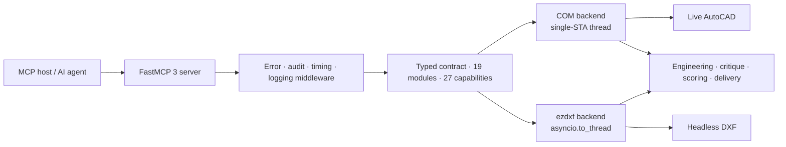

<div align="center">

# AutoCAD MCP Pro

**Production-grade AutoCAD automation for AI agents.**
Live through COM on Windows, or headless through ezdxf on any platform — one typed contract, two engines.

[](https://github.com/U-C4N/Autocad-MCP/actions/workflows/ci.yml)
[](https://pypi.org/project/autocad-mcp-pro/)
[](https://pypi.org/project/autocad-mcp-pro/)
[](https://github.com/U-C4N/Autocad-MCP/blob/main/pyproject.toml)
[](https://github.com/jlowin/fastmcp)
[](https://github.com/U-C4N/Autocad-MCP/blob/main/LICENSE)
[](https://github.com/U-C4N/Autocad-MCP/stargazers)

[Install](#install-in-10-seconds) · [Evidence](#evidence) · [Two engines](#the-two-engines) · [Limits](#what-this-release-is-bad-at) · [Config](#configuration) · [Changelog](https://github.com/U-C4N/Autocad-MCP/blob/main/CHANGELOG.md)

</div>

---

<div align="center">


<sub><b>Not a mockup.</b> Every line on this sheet was drawn by the tools this server exposes — ISO layers, involute gear geometry, DIN 6885 keyway, section A-A, ISO 129 dimensions, an ISO 286 <code>H7</code> bore fit, ISO 7200 title block — then rendered headlessly by <code>view_screenshot</code>. <code>drawing_critique</code> returns <b>0 issues</b> on it. Rebuild it with <code>python scripts/render_readme_showcase.py</code>.</sub>

</div>

---

> **v1.5 release snapshot:** 154 tools · 6 resources · 5 prompt templates · 1258 collected tests.
> 154 is the **registered** count. A default install **advertises 149** over `tools/list`, because
> `ENABLE_3D` is unset and the five `solid_*` tools stay hidden. `system_about` is the runtime authority.

## Why this exists

Two problems, both measured before a line was written.

**A big MCP server is expensive to be connected to.** The full catalog puts an estimated **40,305 tokens** on the wire before the client has asked for anything, of which about **25,143** are the part a client actually forwards to the model — 149 advertised tools at ~169 tokens of name, description and input schema each. Turning on discovery replaces that catalog with two tools and **356** wire tokens.

**A drafter searches for `WBLOCK`, not for `block_create_from_entities`.** `WBLOCK`, `PEDIT`, `OVERKILL`, `LAYTRANS` and `MATCHPROP` appeared in *no* tool name or description, so they scored `df = 0` against a stock text index — not badly ranked, *absent*. No amount of tuning finds a word that is not in the data, so the fix was data: an authored corpus of **158 distinct AutoCAD command names and 672 synonym phrases** covering all 154 tools, layered onto the index. A test holds that df=0 list honest in both directions — it fails if one of those commands becomes findable without the corpus, and it fails if the corpus stops covering one.

| Advertised surface | Tools a client sees | `tools/list` on the wire |
|---|---:|---:|
| `TOOL_PROFILE=full` (default) | 149 | 40,305 tokens |
| `TOOL_PROFILE=lean` | 47 | 12,131 tokens |
| `DISCOVERY_MODE=search` | 2 | **356 tokens** |

> [!NOTE]
> Token figures are **estimates** from an offline ratio counter (`ratio/v1`), not tokenizer counts — characters are the measured unit and the report says so. Under prompt caching the idle term is largely amortised, so read **113×** as the *uncached* wire ratio, not a bill. `python -m benchmarks.token_suite --tokenizer anthropic` counts for real, but it needs the `anthropic` package and credentials, neither of which is in this repo's lock — it refuses rather than silently falling back.

## Install in 10 seconds

```bash
pip install autocad-mcp-pro     # or: uvx autocad-mcp-pro
autocad-mcp                     # stdio MCP server, backend auto-selected
```

Headless anywhere, or live AutoCAD on Windows:

```bash
AUTOCAD_MCP_BACKEND=ezdxf autocad-mcp    # portable DXF engine, no AutoCAD needed
AUTOCAD_MCP_BACKEND=com   autocad-mcp    # live AutoCAD (pip install "autocad-mcp-pro[com]")
```

| Extra | Pulls in | For |
|---|---|---|
| *(none)* | `fastmcp`, `ezdxf`, `pydantic` | Headless DXF on any OS — **no rendering** |
| `[com]` | `pywin32`, `Pillow` | Live AutoCAD control + window capture |
| `[pdf]` | `matplotlib` | PDF export and headless PNG rendering, any platform |
| `[full]` | everything above | Development and CI |

> [!NOTE]
> The bare install **cannot draw pixels**. `ezdxf.addons.drawing.frontend` does an unconditional top-level `import PIL.Image`, so Pillow is required by *every* ezdxf render path — PNG screenshot and PDF export alike — not just by the COM window capture it is listed under. Add `[pdf]` (or `[full]`) if you want images on Linux or macOS.

From a checkout: `pip install -e ".[full]"` on Windows, or `pip install -e ".[pdf]"` elsewhere, then `python server.py`. (`[com]` and `[full]` carry a `sys_platform == "win32"` marker on `pywin32`, so they resolve everywhere — they simply install nothing Windows-specific off Windows.)

### Wire it to a client

```json
{
  "mcpServers": {
    "autocad": {
      "command": "autocad-mcp",
      "env": {
        "AUTOCAD_MCP_BACKEND": "auto",
        "ALLOWED_PATHS": "C:\\Users\\you\\Documents\\AutoCAD",
        "TOOL_PROFILE": "full",
        "DISCOVERY_MODE": "off"
      }
    }
  }
}
```

Works with Claude Desktop, Cursor, or any stdio MCP host. For HTTP: `autocad-mcp --transport http --port 8000` — loopback only unless remote HTTP is explicitly enabled **and** a bearer token is set. The model vendor is not part of the server contract.

## What you get

<table>
<tr><th align="left">Area</th><th align="left">What it does</th></tr>
<tr><td><b>Drawing lifecycle</b></td><td>create, open, save, export DXF/PDF, audit <i>(now repairs)</i>, purge; undo/redo live on COM and opt-in headless via <code>EZDXF_UNDO_DEPTH</code></td></tr>
<tr><td><b>Geometry</b></td><td>lines, arcs, polylines, splines, hatches, trim/extend/fillet/chamfer, handle-preserving edits</td></tr>
<tr><td><b>Annotation</b></td><td>ISO 129 toleranced dimensions, ISO 286 fits (<code>fit="H7"</code>), TABLE, MLEADER, GD&amp;T frames and datums (ISO 1101)</td></tr>
<tr><td><b>Engineering generators</b></td><td>involute gears (front + section A-A), DIN 6885 keyed bores, ISO A3 title block</td></tr>
<tr><td><b>Discovery</b> ✨</td><td><code>search_tools</code> ranked over an AutoCAD command and synonym corpus — <code>FILLET</code>, <code>BPOLY</code>, <code>QSELECT</code>, <code>WBLOCK</code>, <code>OVERKILL</code>, <code>CHSPACE</code> each rank <b>#1</b> of the 149-tool advertised catalog</td></tr>
<tr><td><b>Batching</b> ✨</td><td><code>cad_batch</code> runs a whole step list in one round trip; <code>fields=</code> projects the response on 11 result-heavy tools (a closed, gated list)</td></tr>
<tr><td><b>Paper space</b> ✨</td><td>tab lifecycle, viewports and <code>drawing_export_pdf(layout=...)</code> on both engines; <code>entity_change_space</code> (CHSPACE) headless only</td></tr>
<tr><td><b>Selection</b> ✨</td><td>window vs crossing stated back to the caller; a polygon tested against its own shape, not its bounding box</td></tr>
<tr><td><b>Boundaries</b> ✨</td><td><code>boundary_trace</code> (BOUNDARY/BPOLY) chains loose edges into one closed polyline, arcs kept as bulges — <i>headless engine only</i></td></tr>
<tr><td><b>Measurement</b> ✨</td><td><code>analysis_measure_entity</code> measures what is <i>in</i> the drawing, by handle</td></tr>
<tr><td><b>Hatch depth</b> ✨</td><td>gradients, in-place edits and island styles on both; typed edge boundaries headless only</td></tr>
<tr><td><b>Annotation objects</b> ✨</td><td>WIPEOUT, REVCLOUD, MTEXT background masks — <i>headless only, ActiveX exposes no member</i> — plus text find/replace on both</td></tr>
<tr><td><b>3D solids</b></td><td><code>solid_box/cylinder/extrude/revolve/boolean</code> on live AutoCAD (<code>ENABLE_3D=true</code>)</td></tr>
<tr><td><b>Quality loop</b></td><td><code>drawing_preflight</code> → <code>drawing_plan</code> → <code>drawing_critique</code> → <code>drawing_refine</code> → <code>drawing_finalize</code> (0–100 score)</td></tr>
<tr><td><b>Delivery</b></td><td><code>drawing_deliver</code>: DXF/PDF/PNG + SHA-256 manifest + reopen-parity checks</td></tr>
</table>

<sub>✨ = new in v1.5.0. 154 tools across 19 groups — <code>entity_creation</code> 18, <code>entity_modification</code> 15, <code>layers</code> 14, <code>analysis</code> 12, <code>layouts</code> 12, <code>premium</code> 12, <code>drawing</code> 11, <code>engineering</code> 10, <code>blocks</code> 8, <code>entity_query</code> 8, <code>system</code> 7, <code>dimensions</code> 5, <code>solids</code> 5, <code>corner_ops</code> 4, <code>view</code> 4, <code>batch</code> 3, <code>transactions</code> 3, <code>templates</code> 2, <code>validation</code> 1.</sub>

Alongside the tools, **6 MCP resources** cost nothing in the tool budget and are browsable at any time — `autocad://drawing/info`, `autocad://layers`, `autocad://blocks`, `autocad://entities/stats`, `autocad://entities/{layer_name}`, `autocad://system/status` — plus **5 prompt templates** (`prompt_mechanical_drawing`, `prompt_floor_plan`, `prompt_electrical_schematic`, `prompt_pid_diagram`, `prompt_quick_drawing`).

### Two rules worth knowing before you draw

**Every coordinate in and out of a tool is WCS, on both engines** — with one deliberate exception. DXF stores CIRCLE / ARC / LWPOLYLINE / TEXT / INSERT geometry in a per-entity frame, and before v1.5.0 the word `extrusion` appeared nowhere in this codebase, so a mirrored or rotated entity reported coordinates that were quietly wrong. An entity in a plane tilted out of WCS XY now reports `plane_normal` and omits the fields xy cannot express, rather than answering with a number that looks fine. The exception is **TEXT `rotation`**, which stays in the entity frame on purpose: a mirrored TEXT is mirror-imaged, and no single scalar angle expresses that.

**Never read vertices back and shoelace them.** That loses **28.2%** of the area on a semicircular edge, silently. `analysis_measure_entity(handle)` reads the real geometry and states its own accuracy: `exact`, `flatten_tolerance`, `assumed_closed`, `self_intersecting`.

## The two engines

One contract, split across 19 modules in `backends/contracts/`. Most are ABCs; `gdt.py` and `settings.py` are concrete shared mixins rather than interfaces. Optional methods are declarative — `@capability(key, reason=...)` supplies a default that *refuses* — and a test holds the two backends' capability key sets equal, so a key cannot exist on one engine and be forgotten on the other.

There are **27 capability keys**. `system_capabilities` returns the live map, and you should read it at runtime rather than trusting the table below, because five of the 27 depend on how the machine is set up:

| Capability | COM (live AutoCAD) | ezdxf (headless) |
|---|:---:|:---:|
| Live document control | ✅ | — |
| Cross-platform, no AutoCAD | — | ✅ |
| Transactions and rollback | ✅ | ✅ |
| Paper-space layouts + viewports | ✅ | ✅ |
| Viewport model-content rendering | ✅ | ✅ ᵐ *(no viewport borders)* |
| Selection window / crossing / polygon | ✅ | ✅ |
| Entity area by handle | ActiveX `.Area` | Analytic, bulges included |
| HATCH filled area (islands subtracted) | AutoCAD's own number | Loops walked, `hatch_style` reported |
| REGION / 3DSOLID area | ✅ | — *ACIS is opaque to ezdxf* |
| 3D solids | ✅ *only with `ENABLE_3D=true`* | — *no headless ACIS* |
| DWG write | ✅ | — *no DWG writer* |
| WIPEOUT | — *`AddWipeout` verified absent, AutoCAD 2026* | ✅ |
| MTEXT background colour | — *`BackgroundFillColor` verified absent, AutoCAD 2026* | ✅ |
| REVCLOUD, BPOLY / boundary tracing | — *no ActiveX member; command-line only* | ✅ |
| CHSPACE (`entity_change_space`) | — *unverified against a live seat* | ✅ ᶜ |
| Undo history | ✅ | opt-in — `EZDXF_UNDO_DEPTH` defaults to `0` |
| TABLE and MLEADER | Native | Portable composite |
| Raw commands / AutoLISP | Opt-in | — |
| Screenshots and PDF export | AutoCAD window capture | Matplotlib render ᵐ |

<sub>ᵐ Needs matplotlib — the `[pdf]` or `[full]` extra. Without it `png`, `pdf`, `viewport_render` and `handle_overlay` all report unsupported on the headless engine.<br>
ᶜ The headless CHSPACE carries four named restrictions in its own capability reason: top-view untwisted viewports only, dimensions refused unless frozen, ACIS/proxy/table refused, and viewport clipping reported rather than applied.</sub>

> [!IMPORTANT]
> Every COM path added in v1.5.0 was executed against a **live AutoCAD 2026** before release. That run found four defects no amount of reading would have caught — the largest being that `AcadPViewport` has no `ViewCenter` member, so the line setting it had been silently swallowed by a bare `except` since v1.4.

## Evidence

Every number below is produced by a script in [`benchmarks/`](https://github.com/U-C4N/Autocad-MCP/blob/main/benchmarks/) and rendered to SVG by Python. No hand-edited charts.

### 1 · Live-run scores


| Server | Matrix | Pinned | Score | Pass |
|---|---|---|---:|---:|
| **autocad-mcp-pro** *(this repo)* | v3 · 15 tasks | working tree | **100.0** | 15/15 |
| [beiming183-cloud/AutoCAD-MCP](https://github.com/beiming183-cloud/AutoCAD-MCP) | v2 · 10 tasks | `11f7c47` | 50.0 | 5/10 |
| [puran-water/autocad-mcp](https://github.com/puran-water/autocad-mcp) | v2 · 10 tasks | `95476a3` | 45.0 | 4/10 |

> [!WARNING]
> **Read the matrix column before the score column.** The five v3 tasks are new in v1.5.0; the competitor runs are from 2026-07-23 against pinned competitor commits, and were never put to them. Their scores are over the ten tasks they actually ran, and the five new rows render blank rather than as zeros — an invented zero is indistinguishable from a measured one. These bars do not share a denominator, which is why each one carries its matrix.

Competitors are driven **black-box over MCP stdio** using their own documented tool contracts at the pinned commit, and every geometry claim is verified by re-opening the exported DXF with ezdxf inside the harness. No self-reporting. A capability refusal is recorded `unsupported`, not `fail` — "cannot reach this" and "got this wrong" are different findings.

### 2 · Task matrix — where the score comes from


**v2 scored this repo 10/10, and that number carried no information**: every task in it exercised something the server was built around. v3 adds five tasks chosen because they *can* fail — and three of them did, while being written.

| v3 task | Verified against |
|---|---|
| `tool_discovery` | six AutoCAD command names, each ranking **#1** of the 149-tool advertised catalog |
| `token_budget` | 40,305 → 356 tokens advertised, against a 2,000 ceiling fixed in advance |
| `hatch_islands` | **300** filled with the island, 400 ignoring it |
| `selection_filter` | window 1, crossing 2, bounding box 3, polygon 1 |
| `measure_from_handle` | **139.2699** against the 100.0 a vertex shoelace gives |

### 3 · Correctness A/B — every release re-proves itself

26 deterministic headless checks against the previous tag and the current tree, each in its own subprocess so a hard crash counts as a miss rather than killing the run.

| Version | Checks passing | Pass rate | Fixed | Regressed |
|---|---:|---:|---:|---:|
| v1.4.0 *(baseline)* | 21 / 26 | 80.8 % ᵃ | — | — |
| **v1.5.0** *(this release)* | **26 / 26** | **100 %** | 5 | **0** |

<sub>ᵃ Against the 26-check v1.5.0 suite. v1.4.0 passed 21/21 of the checks that existed when it shipped.</sub>

The five splits into two kinds, and the difference matters:

- **Three are new capability, not repaired regressions.** v1.4.0 has no `entity_measure` and no boundary tracing, so it misses `hatch_area_subtracts_its_island`, `boundary_area_agrees_with_measure` and `two_vertex_circle_has_area` by not having the method.
- **Two are real defects that v1.4.0 shipped.** It has `dimension_diameter` and `dimension_radius`, and both returned the wrong number: `leader_length` — a *text placement* — was being measured as geometry, so at default settings every diameter callout came out **2 × leader_length too large** (60 on a true ⌀40) and every radius `leader_length` too large. Found while building the drawing at the top of this page. The live COM backend was never affected.

The 21 pre-existing checks are unchanged and all still pass: the discovery layer, `cad_batch`, the 19-module contract split, layouts/viewports and Wave A landed with **zero correctness regressions**.

### 4 · Headless performance


| Workload | Wall time | Result |
|---|---:|---|
| Create 2,000 lines (individual calls) | 0.32 s | ~6,300 entities/s |
| 10,000 lines: build + DXF export + reopen | 2.16 s | ~4,600 entities/s end-to-end |
| Region query over 10,000 entities | 0.89 s | 2,500 matched |
| Premium pass (layers + part + dims + full critique) | 0.18 s | 0 issues |

Workloads call the same backend methods the MCP tools call, so server-side overhead is included. **Self-measurement only** — competitor servers pay an extra stdio serialization cost that in-process runs do not, so no cross-server timing claims are made.

> [!CAUTION]
> These are **not** an improvement over v1.4.0. Measured against v1.4.0 on the same interpreter, this release is **28% slower** at creating entities — see [what this release is bad at](#what-this-release-is-bad-at) for the number and its full attribution.

### 5 · Source-review leaderboard


Nine public AutoCAD MCP projects against a fixed 100-point rubric — CAD breadth (25), correctness and delivery (20), backends/platforms (15), engineering production (15), tests and maintenance (15), security and operations (10). Stars and raw tool counts score nothing. Data and dates in [`benchmarks/source_review.json`](https://github.com/U-C4N/Autocad-MCP/blob/main/benchmarks/source_review.json).

**This table is not re-scored per release.** This repository's row is still the one written against **v1.4.0**. Raising our own number for v1.5.0 would mean re-reviewing eight other projects the same day to keep it fair, and that has not been done — so the score stays where the evidence is.

Method, caveats and boundaries for every lane: [`benchmarks/README.md`](https://github.com/U-C4N/Autocad-MCP/blob/main/benchmarks/README.md).

## What this release is bad at

A page that only lists strengths is a page that has not been measured.

**Entity creation is 28% slower than v1.4.0.** Measured on one interpreter, median of three runs: 2,000 lines went 245 ms → 315 ms, and the 10,000-line roundtrip 1,765 ms → 2,146 ms. Fully attributed — setting `EZDXF_CALL_TIMEOUT=0` returns v1.5.0 to **244.8 ms** and **1,679 ms**, which are v1.4.0's numbers exactly. The cost is the per-call `asyncio.wait_for` this release wrapped around every headless call so that one hung call can no longer wedge a server whose document lock is a single `asyncio.Lock`. A deliberate trade, with a documented knob, on the 1.6 roadmap to win back.

> The v1.4 README printed *slower* numbers than the table above — 0.64 s and 13.9 s for the same two workloads. That looks like a 2–6× win and is not one: the old report was recorded on CPython 3.14 and this one on 3.11.15. Interpreter, not code. Comparing the two published files directly is the mistake this paragraph exists to stop.

**Wave A shipped 13 tools of a planned 39.** Every cut is backed by a measurement. The REGION and 2D-boolean family went because `add_region()` produces a REGION with **zero ACIS bytes**, and the `greiner_hormann` substitute loses **28.2%** of the area on a square with one semicircular edge — shipping it would have re-created the exact class of silent error this release spent four milestones deleting. Most of the planned measurement family was already covered by the eight `analysis_*` tools that existed.

**`system_run_command` / `system_run_lisp` are a guardrail, not a security boundary** — the rejection message clients receive says so in those words. A 36-verb command denylist and a 24-pattern AutoLISP denylist refuse the obviously destructive cases, but AutoCAD accepts hundreds of commands and any loaded ARX/LISP adds more, so the list cannot be complete, and `DANGEROUS_COMMANDS_ENABLED=true` switches both off entirely.

**Path validation is per-tool, and unscoped until you scope it.** Nine tools call `validate_path`; nothing in the middleware enforces it server-wide. With `ALLOWED_PATHS` empty — the default — the only positive bound is a ten-entry system-directory denylist that does not include `C:/Users`, `/home`, `/root` or `/var`. **Set `ALLOWED_PATHS`.** It is the setting that actually scopes the filesystem.

**Non-AutoCAD ProgIDs are unverified.** `CAD_PROGID` changes which COM application the backend attaches to, and nothing beyond the connection has been tested against BricsCAD, ZWCAD or GstarCAD. They are listed in `.env.example` commented out and marked UNVERIFIED.

## Configuration

Nothing here loads a `.env` file — there is no dotenv dependency. Export these, or set them in your MCP client's `env` block. `.env.example` is documentation, and it is not the full list.

<details>
<summary><b>All 16 environment variables</b></summary>

| Variable | Default | Purpose |
|---|---|---|
| `AUTOCAD_MCP_BACKEND` | `auto` | `auto`, `com`, or `ezdxf` |
| `CAD_PROGID` | `AutoCAD.Application` | COM ProgID the live backend attaches to (unverified for clones) |
| `TOOL_PROFILE` | `full` | `lean` (47 curated tools) or `full` |
| `DISCOVERY_MODE` | `off` | `search` replaces the catalog with `search_tools` + `call_tool` |
| `ENABLE_3D` | `false` | Expose the opt-in `solid_*` tools (COM backend) |
| `LOG_LEVEL` | `INFO` | Python logging level |
| `ALLOWED_PATHS` | *(empty)* | Comma-separated absolute paths the server may access |
| `MAX_UNDO_STACK` | `5` | Maximum retained undo snapshots |
| `EZDXF_UNDO_DEPTH` | `0` | Headless undo history depth; `0` disables it |
| `MAX_DXF_BYTES` | `52428800` | Reject larger DXF input; `0` disables |
| `MAX_LIST_LIMIT` | `5000` | Bound list/selection response sizes |
| `COM_CALL_TIMEOUT` | `60` | Per-call live AutoCAD timeout (seconds); `0` disables |
| `EZDXF_CALL_TIMEOUT` | `120` | Per-call headless timeout (seconds); `0` disables |
| `DANGEROUS_COMMANDS_ENABLED` | `false` | Allow blocked commands/LISP; reported as unsafe mode |
| `ALLOW_REMOTE_HTTP` | `false` | Permit a non-loopback HTTP bind |
| `MCP_AUTH_TOKEN` | *(empty)* | Bearer token required for remote HTTP |

</details>

## Architecture



| Path | Role |
|---|---|
| `server.py` | FastMCP surface, lifespan, middleware, resources, prompts |
| `backends/contracts/` | The typed contract, one module per domain |
| `backends/capability.py` | Capability model, typed refusals, `@capability` |
| `backends/ocs.py` | OCS ↔ WCS translation at the backend boundary |
| `backends/com_backend.py` | Single-STA-thread COM executor with per-call timeouts |
| `backends/ezdxf_backend.py` | `asyncio.to_thread`-wrapped DXF engine, snapshot transactions |
| `discovery/` | Alias corpus, ranking transform, compact serializer |
| `engineering/` | Standards, generators, critique, fits, scoring, delivery |
| `security.py` | Path validation, command and AutoLISP sanitization |

### The drawing at the top of this page, as tool calls

Not pseudocode — this is the sequence in [`scripts/render_readme_showcase.py`](https://github.com/U-C4N/Autocad-MCP/blob/main/scripts/render_readme_showcase.py), which produced the sheet in the hero image:

```text
drawing_new()                                    fresh document, ISO linetypes + layers bootstrapped
drawing_apply_iso_layers("mech")                 ISO 128 lineweights per layer
drawing_settings({units: "mm", linear_precision: 2})

gear_draw_spur_front_view(                       involute flanks, not a decorated circle
    module=6, teeth=24, center=[135, 172],
    bore_diameter=40, keyway_width=12, keyway_depth=3.3)
gear_draw_section_aa(x_offset=300, face_width=46)

dimension_linear(...)                            ISO 129
dimension_diameter(..., fit="H7")                deviations from authored ISO 286 tables
titleblock_apply_iso_a3(title="SPUR GEAR m6 z24", material="C45E", ...)

drawing_critique(focus=None)                     -> []  must be empty before finalize
view_screenshot()                                -> PNG
```

The full production loop adds `drawing_preflight` and `drawing_plan` at the front (the plan is held by the backend and replayed by `drawing_critique` at finalize time), `drawing_refine` after the critique, and `layout_create` + `viewport_create` + `drawing_deliver` at the end for a hashed, reopen-verified handoff.

## Development

`uv.lock` pins the whole transitive graph — runtime *and* dev tools — so this reproduces CI exactly rather than approximately:

```bash
uv sync --locked --all-extras
uv run pytest
uv run ruff check . && uv run ruff format --check .
```

CI runs on Linux (3.11 / 3.12), Windows (mocked-COM suite), plus package, Docker and MCP-registry-schema jobs. The package job deliberately stays *unlocked* — it is the one that proves a plain `pip install autocad-mcp-pro` still resolves. A scheduled `deps-floating` workflow resolves the ranges fresh and re-runs the suite, so a locked CI does not become blindness to upstream drift. Releases are tag-driven: `git tag vX.Y.Z && git push origin vX.Y.Z`.

## Roadmap (1.6)

Give back the 25% creation throughput the per-call timeout costs — arm it only for calls that can actually block. ISO 286 interference **shafts** r/s/t/u (they need sub-stepped table data nothing in the module can derive; 1.5 refuses them by name instead of guessing). HATCH boundary *geometry* in `entity_get` — 1.5 measures a hatch's filled area but still does not hand back its loops. REGION/3DSOLID area headlessly, which needs a modelling kernel ezdxf does not have. An *allowlist* of permitted AutoLISP heads, replacing the denylist — enumerating dangerous symbols does not terminate. `ezdxf.recover` as a fallback on `drawing_open`.

Features are published when their contracts and limitations are testable — not when they make a longer checklist.

## Star history

<div align="center">

<a href="https://star-history.com/#U-C4N/Autocad-MCP&Date">
  
</a>

If this saved you a day of drafting, a star helps other engineers find it.

</div>

## Contributing

Pull requests are welcome — especially reproducible competitor adapters, mocked/live COM coverage, engineering standards, and backend parity. For a large change, open an issue first so the tool contract and evidence plan can be agreed before implementation.

## Author

**Umutcan Edizsalan** · Mechanical engineering work at **Anka-Makine** · GitHub [@U-C4N](https://github.com/U-C4N)

Built from production drawing work, then made model-agnostic through MCP.

## License

[MIT](https://github.com/U-C4N/Autocad-MCP/blob/main/LICENSE)

<!-- MCP registry ownership marker; must equal the "name" in server.json. -->
mcp-name: io.github.u-c4n/autocad-mcp
