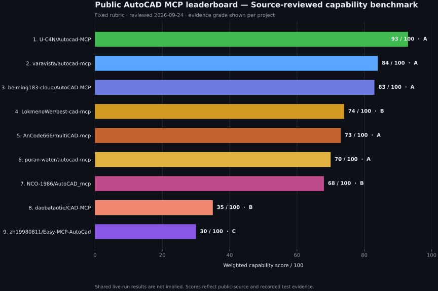

# Benchmarks



## Two evidence layers

This repository publishes two deliberately separate forms of evidence:

1. **Source-reviewed capability benchmark.** Nine named AutoCAD MCP projects are
   scored with a fixed 100-point rubric covering CAD breadth, correctness and
   delivery, backend reach, engineering production, tests, and security. The
   dated data lives in [`source_review.json`](source_review.json), and the README
   graphic is generated—not hand-edited—from that file.
2. **Fixed-task runtime benchmark.** Adapters execute the same task matrix and
   return `pass`, `partial`, `unsupported`, `fail`, `timeout`, or `not_run`.
   AutoCAD MCP Pro currently has the reference adapter; other projects do not
   receive runtime scores until an adapter actually runs their public interface.

Regenerate the source-review chart:

```bash
pip install -e ".[pdf]"
python -m benchmarks.render_chart
```

The source-review chart is not presented as a shared live AutoCAD run. Review
dates, evidence grades, project URLs, and the boundary are stored with the data.

## Fixed-task runtime runner

The runner separates runtime evidence from the source-review rubric. Every
adapter receives the same tasks and produces the same closed result enum:
`pass`, `partial`, `unsupported`, `fail`, `timeout`, or `not_run`. A timeout is
reported per task, and a capability refusal is recorded `unsupported` rather
than `fail` — "cannot reach this" and "got this wrong" are different findings.
Execution is in-process, so adapters that delegate blocking work must provide
cancellation-safe task implementations or be wrapped by an external process
supervisor. Reports include commit SHA, Python/platform details, backend
capability claims, durations, coverage, and hashes for returned artifacts.
Unsupported tasks remain in the fixed-matrix denominator with score zero,
preventing partial implementations from receiving an inflated score.

```bash
python -m benchmarks.run_competitors --list --matrix v3
python -m benchmarks.run_competitors --server autocad-mcp-pro --backend ezdxf --matrix v3 --json
python -m benchmarks.run_competitors --task table_mleader --task hatch_islands --json
```

The release-machine ezdxf self-check is **15/15 (100.0)** on the v3 matrix.
Repository stars and raw tool counts do not contribute to the score. Adapter
registration lives in `competitors.yaml`.

### Matrix v3 (v1.5.0) — five tasks that can fail

v2 scored this server 10/10, and that number carried no information: every task
in it exercised something the server was designed around. `tasks_v3.py` keeps
the v2 ten unchanged — their ids and weights key the published v1.4 reports —
and adds five chosen because they *can* fail. Three of them did, while being
written:

| Task | Category | Verified against |
|---|---|---|
| `tool_discovery` | discovery | six AutoCAD command names, each found in the top 3 of the 154-tool registry the harness ranks — all six came back #1 in the published run |
| `token_budget` | efficiency | 40,305 → 356 tokens advertised, against a 2,000 ceiling fixed in advance |
| `hatch_islands` | hatch | 300 filled with the island, 400 ignoring it |
| `selection_filter` | selection | window 1, crossing 2, bounding box 3, polygon 1 |
| `measure_from_handle` | measurement | 139.2699 against the 100.0 a vertex shoelace gives |

Token counts come from the offline ratio estimator and the report labels them
`ratio/v1 (estimate)`; `token_suite.py --tokenizer anthropic` counts for real.

**Two renames from the release plan, and they are the point.**
`tool_discovery_bilingual` → `tool_discovery`: a Turkish query normalizer was
written and then removed, because this repository is English throughout and the
Turkish was inferred from the author's chat language rather than required by the
product. `measurement_massprops` → `measure_from_handle`: no centroid or
moment-of-inertia tool ships.

**The competitor reports are not re-scored.** Those servers are pinned at v1.4
commits and were run against the v2 matrix; they have never been asked these
five questions. Their scores stand over the ten they ran, and the matrix chart
leaves the five new rows blank (`not run`) instead of scoring them zero — a
zero we invented would be indistinguishable from a zero we measured.

`--matrix v2` stays available so a v1.4 report can be reproduced rather than
only described, and `--publish` writes the artifact-path-free file that
`results/published/` holds.

## Live competitor lane (v1.4)

Two competitor adapters now execute the exact same task matrix, black-box over
MCP stdio, against commits pinned in `competitors.yaml`:

| Server | Matrix | Pinned | Score | Pass | Coverage |
|---|---|---|---:|---:|---:|
| autocad-mcp-pro (reference) | v3 (15) | working tree | 100.0 | 15/15 | 100% |
| beiming183-cloud/AutoCAD-MCP | v2 (10) | `11f7c47e` | 50.0 | 5/10 | 50% |
| puran-water/autocad-mcp | v2 (10) | `95476a33` | 45.0 | 4/10 | 50% |

The competitor rows are the v1.4 runs, unchanged. Read the matrix column
before the score column: the denominators differ because the five v3 tasks
were added after those runs and have not been put to them.

Method and boundaries:

- `benchmarks/competitors_env.py` clones the pinned SHA into
  `benchmarks/.competitors/<id>/` (gitignored), builds an isolated venv, and
  installs the competitor from its own `pyproject.toml`.
- `benchmarks/adapters/mcp_stdio.py` drives the competitor exactly like an MCP
  host (fastmcp `Client` over stdio). No competitor code is imported.
- Task playbooks call each server's **own documented tool contract**, read from
  the pinned source (consolidated `operation` + payload tools; beiming's
  `doc_id`/`expected_revision` discipline is honored via
  `transaction(operation="context")`).
- **Verification never trusts the competitor's response**: every geometry claim
  must survive `save`/`save_as_dxf` and re-opening the DXF with ezdxf inside
  the harness.
- Tasks with no documented equivalent are reported `unsupported` with the
  reason string; they stay in the fixed-matrix denominator at score zero.
- This lane is headless (ezdxf backends only). File-IPC / live-AutoCAD lanes
  (including COM-only servers such as best-cad-mcp or daobataotie/CAD-MCP)
  require a local AutoCAD session and are out of CI scope by design.

Published machine-readable reports (artifact paths sanitized to filenames)
live under [`results/published/`](results/published/); the README charts are
regenerated from them:

```bash
python -m benchmarks.run_competitors --server puran-water-autocad-mcp --backend ezdxf --matrix v2
python -m benchmarks.run_competitors --server beiming183-autocad-mcp --backend ezdxf --matrix v2
python -m benchmarks.render_live_chart     # score bars
python -m benchmarks.render_matrix_chart   # tasks x servers status heatmap
```

`--publish <path>` writes the same report with artifact paths reduced to
filenames, which is how `results/published/` is produced; the sha256 stays,
because that is what makes an artifact checkable.

## Headless performance lane

`perf_suite.py` measures wall time on fixed workloads through the same backend
methods the MCP tools call (server-side overhead included): 2,000 individual
line creates, a 10,000-entity build → DXF export → reopen roundtrip, a region
query over 10,000 entities, and a full premium quality pass (ISO layers,
geometry, dimensions, complete critique). The report records the machine
fingerprint; numbers move with hardware, workload definitions do not.
**Self-measurement only** — competitor servers would pay an extra stdio
serialization cost that in-process runs do not, so no cross-server timing
claims are made.

```bash
python -m benchmarks.perf_suite --out benchmarks/results/published/perf-ezdxf.json
python -m benchmarks.render_perf_chart
```

### What the call-timeout guard costs

The published v1.4 report was recorded on CPython 3.14 and the later ones on
3.11.15, so comparing those two files directly shows an apparent 2–6× speedup
that is almost entirely the interpreter. The comparison that means something is
the guard against no guard, on one interpreter, back to back. Three runs of
each configuration, median taken by hand — `perf_suite` executes each workload
once per invocation and cannot produce a median itself:

| Workload | `EZDXF_CALL_TIMEOUT=0` | default (120 s) | Cost |
|---|---:|---:|---:|
| `create_lines_2k` | 243.7 ms | 294.3 ms | **+20.8%** |
| `roundtrip_10k` | 1,709.6 ms | 2,049.2 ms | **+19.9%** |

v1.5.0 paid 28.6% on the first workload; v1.5.1 rebuilt the wrapper around a
single `asyncio.timeout_at` instead of two `asyncio.wait_for`s — `wait_for`
wraps its awaitable in a Task, so the old shape created two extra Tasks and two
timer handles per call — which recovered about a third of the overhead. The
rest is the Task the abandon-on-timeout design genuinely needs. The guard is
what stops one hung ezdxf call wedging a server whose document lock is a single
`asyncio.Lock`, so it stays; the knob is documented rather than hidden.

These figures are hand-collected and have **no published artifact** —
`perf-ezdxf.json` records one default-configuration run only. Reproduce:

```bash
for i in 1 2 3; do
  python -m benchmarks.perf_suite --out /tmp/on-$i.json
  EZDXF_CALL_TIMEOUT=0 python -m benchmarks.perf_suite --out /tmp/off-$i.json
done
```

## Correctness A/B suite

`correctness_suite.py` is a set of deterministic, headless (ezdxf-backend) checks
that exercise real drawing operations. `compare_versions.py` runs the **same**
suite against an older git ref and the current checkout, each check in its own
subprocess so a hard crash (e.g. a matplotlib-in-thread `SIGSEGV`) is recorded as
a miss rather than taking down the run.

Reproduce:

```bash
python benchmarks/compare_versions.py            # current tree vs origin/main
python benchmarks/compare_versions.py v1.0.0     # vs a tag/ref
python benchmarks/compare_versions.py --json results.json
```

### Result — v1.5.1 vs v1.5.0 (release gate)

26 checks, ezdxf backend, one subprocess per check. Machine-readable report:
[`results/published/ab-v1.5.0-vs-v1.5.1.json`](results/published/ab-v1.5.0-vs-v1.5.1.json).

| Version | Checks passing | Pass rate | Fixed | Regressed |
|---------|----------------|-----------|-------|-----------|
| **v1.5.0** (baseline)     | 24 / 26 | 92.3 % | — | — |
| **v1.5.1** (this release) | 26 / 26 | 100 % | 2 | **0** |

v1.5.0 fails `diameter_dim_measures_the_diameter` and
`radius_dim_ignores_the_leader_length`: it has both methods and gets both
wrong. That is the defect 1.5.1 exists to fix and the reason 1.5.0 is yanked.

### Result — this release vs v1.4.0

Same suite, older baseline:
[`results/published/ab-v1.4.0-vs-v1.5.1.json`](results/published/ab-v1.4.0-vs-v1.5.1.json).

| Version | Checks passing | Pass rate | Fixed | Regressed |
|---------|----------------|-----------|-------|-----------|
| **v1.4.0** (baseline)     | 21 / 26 | 80.8 % | — | — |
| **v1.5.1** (this release) | 26 / 26 | 100 % | 5 | **0** |

> This row used to read `v1.5.0 | 24 / 26 | 92.3 % | 5`, which was impossible on
> its face — 21 passing plus 5 fixed is 26, not 24 — and it contradicted the
> report it linked. The cause is worth recording: the file named
> `ab-v1.4.0-vs-v1.5.0.json` was regenerated from a tree that already carried
> the dimension fixes, so it never measured the v1.5.0 *tag*. The v1.5.0 tag
> really does score 24/26, which is what the v1.5.0-baseline table above
> reports. This table now names the tree it actually measured.

The pass rate is against the 26-check current suite; v1.4.0 passed 21/21 of the
checks that existed when it shipped. The five splits into two kinds, and the
difference is the whole reason this lane distinguishes `miss` from `fail`:

* **Three are new capability.** v1.4.0 has no `entity_measure` and no boundary
  tracing, so it misses `hatch_area_subtracts_its_island`,
  `boundary_area_agrees_with_measure` and `two_vertex_circle_has_area` by not
  having the method (`miss → pass`). They are in the suite because all three
  broke during v1.5.0 development and nothing outside their own unit tests
  would have caught it.
* **Two are repaired defects.** v1.4.0 *and v1.5.0* both have
  `dimension_diameter` and `dimension_radius` and both get them wrong
  (`fail → pass`): `leader_length`, a text placement, was being measured as
  geometry, so at default settings every diameter callout came out
  2 × `leader_length` too large. Only 1.5.1 passes them.

The 21 pre-existing checks are unchanged and all still pass: the discovery
layer, `cad_batch`, the 19-module contract split, the layout/viewport family
and Wave A landed with **zero correctness regressions**.

### Result — v1.4.0 vs v1.3.0

21 checks. Report:
[`results/published/ab-v1.3.0-vs-v1.4.0.json`](results/published/ab-v1.3.0-vs-v1.4.0.json).

| Version | Checks passing | Pass rate | Fixed | Regressed |
|---------|----------------|-----------|-------|-----------|
| **v1.3.0** (baseline) | 21 / 21 | 100 % | — | — |
| **v1.4.0**            | 21 / 21 | 100 % | 0 | **0** |

### Result — v1.1.0 vs v1.0.0 (`origin/main`, commit 15fa2bc)

21 checks, ezdxf backend, CPython 3.14, one subprocess per check.

| Version | Checks passing | Pass rate |
|---------|----------------|-----------|
| **v1.0.0** (public release) | 8 / 21 | **38.1 %** |
| **v1.1.0** (this release)   | 21 / 21 | **100 %** |

**13 defects fixed, 0 regressions** — a 2.6× higher correctness pass-rate (+61.9 pts).

Fixed (failed on v1.0.0, pass on v1.1.0):

| Check | Category | What it proves |
|-------|----------|----------------|
| `dim_aligned_no_error` | Dimensions | aligned dim no longer raises `TypeError` |
| `dim_angular_no_error` | Dimensions | angular dim no longer raises `TypeError` |
| `array_polar_360_distinct` | Modify | full-circle array no longer duplicates the original |
| `point_intersection_line_line` | Geometry | deterministic line/line intersection exists & is correct |
| `point_tangent_external` | Geometry | external-point tangent is perpendicular & on-circle |
| `arc_has_length` | Query | ARC carries a `length` property |
| `arc_select_by_length` | Query | `entity_select_smart` length_range selects arcs |
| `ezdxf_bounding_box` | Query | `bounding_box` populated (COM/ezdxf parity) |
| `mtext_rotation_roundtrip` | Entities | MTEXT honors caller rotation |
| `screenshot_png` | Render | headless render returns a valid PNG (no GUI-thread crash) |
| `dim_overlap_critique_fires` | Quality gate | `dim_overlap` critique is live (was a no-op) |
| `iso13567_dim_layer` | Quality gate | `dimension_auto` lands dims on the active set's layer |
| `gear_no_self_overlap` | Engineering | gear outline never dips inside the root circle (z ≥ 42) |

Passing on **both** versions (6 core ops + 2 others) keep the suite honest — it is
not a cherry-picked list of failures; the baseline genuinely does basic CAD work.

### Caveats / honesty notes

- The baseline is `origin/main` (the public v1.0.0). All four audited fix sprints
  land between it and v1.1.0 — see `docs/analysis/`.
- `screenshot_png` on the baseline is host-dependent: it is recorded as a miss
  here because the default matplotlib backend is a GUI backend and the render runs
  off the main thread. On a host where matplotlib defaults to `Agg`, the baseline
  may not crash. v1.1.0 forces `Agg` and is deterministic.
- `center_linetype_applied` passes on both because it only checks the linetype
  **attribute** string (set on both); the v1.0.0 "renders as Continuous because the
  linetype was never loaded" defect is not observable through `EntityInfo`.
- COM-backend behaviour is not covered here (no live AutoCAD); see the mocked-COM
  suites in `tests/`.

Model-by-model tool-call success rates remain future work; scale/throughput
numbers live in the headless performance lane above.
